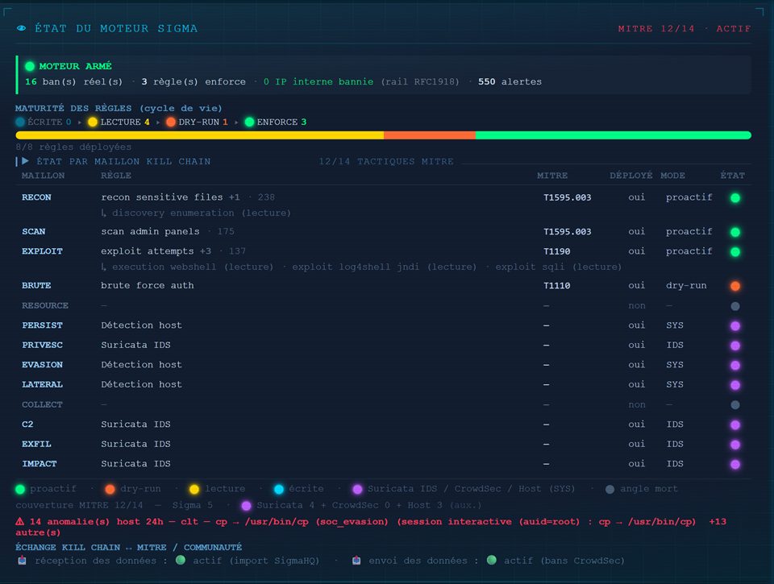

<div align="center">

  <br></br>

  <a href="https://github.com/0xCyberLiTech">
    
  </a>

  <br></br>

  <h2>Moteur de détection — Sigma · maturité par maillon · couverture MITRE multi-moteurs</h2>

  <p align="center">
    <a href="https://0xcyberlitech.github.io/">
      
    </a>
    <a href="https://github.com/0xCyberLiTech">
      
    </a>
  </p>

</div>

---

## Detection-as-code : écrire, tester, documenter

Les détections du SOC sont des **règles versionnées** (format **Sigma**), pas des configs opaques.
Chaque détection suit un **cycle de maturité contrôlé** — on n'arme jamais une règle sur un coup de tête :

```
🔵 écrite  →  🟡 alert-only (lecture)  →  🟠 dry-run (ban SIMULÉ)  →  🟢 enforce (ban réel)
```

On observe d'abord (alert-only), on simule (dry-run, « il bannirait X »), puis on arme **seulement après
review : 0 faux positif prouvé**. Réversible à tout instant (ban court, kill-switch).

<div align="center">

### 🖥️ Le moteur en temps réel



<sub><strong>Le moteur Sigma vu du dashboard SOC</strong> : <strong>verdict</strong> (moteur armé · bans réels · 0 IP interne bannie) · <strong>maturité</strong> de chaque règle (alert-only → dry-run → enforce) · <strong>couverture MITRE 12/14</strong> par maillon Kill Chain.</sub>

</div>

---

## Catalogue des détections (porte d'entrée web)

| Détection | Maillon Kill Chain | MITRE | Mode | Ce qu'elle attrape |
|---|---|---|---|---|
| `recon-sensitive-files` | RECON | T1595.003 | 🟢 enforce | scan de `/.env`, `/.git`, `/.aws/credentials`, `/.ssh/id_rsa`… (vol de secrets exposés) |
| `scan-admin-panels` | SCAN | T1595.003 | 🟢 enforce | énumération de panels (`/wp-admin`, `/phpmyadmin`, `/actuator`, `/manager/html`…) |
| `exploit-attempts` | EXPLOIT | T1190 | 🟢 enforce | traversée (`/etc/passwd`), endpoints RCE (`/cgi-bin/`, `/boaform/`), vol de config |
| `exploit-log4shell-jndi` | EXPLOIT | T1190 | 🟡 alert-only | **Log4Shell** (CVE-2021-44228) : `${jndi:…}` + variantes obfusquées + URL-encodé |
| `exploit-sqli` *(SigmaHQ)* | EXPLOIT | T1190 | 🟡 alert-only | **injection SQL** : union-based · error-based · énumération de schéma · time-based · bypass d'authentification — signatures haut-signal, quasi 0 faux positif (liste complète privée) |
| `brute-force-auth` | BRUTE | T1110 | 🟠 dry-run | acharnement sur les endpoints d'auth — **agrégation par IP au-dessus d'un seuil** (la répétition, pas l'accès) |
| `discovery-enumeration` *(SigmaHQ)* | RECON | T1083 | 🟡 alert-only | énumération de fichiers/dépôts/utilisateurs exposés (`.git`, `.env`, `server-status`, users WP) |
| `execution-webshell` *(SigmaHQ)* | EXPLOIT | T1059 | 🟡 alert-only | exécution via webshell (`cmd=`, `shell_exec`, signatures connues) |

> 🟢 **enforce** = ban réel · 🟠 **dry-run** = simulé (accumule la preuve) · 🟡 **alert-only** = observation.
> BRUTE reste en dry-run tant qu'aucune attaque réelle n'a fourni de donnée à juger (data-gated).

> 🛡️ **Défense en profondeur par maillon** : un même maillon Kill Chain est couvert par **plusieurs
> détections**. Ex. **EXPLOIT** = honeypot `exploit-attempts` (enforce) + `Log4Shell` + `SQLi` +
> `webshell` (alert-only) ; **RECON** = `recon-sensitive-files` (enforce) + `discovery`. Le moteur les
> regroupe par maillon (le honeypot reste le représentant, les autres en complément) — visible dans le
> dashboard. Chaque détection garde sa propre maturité (un maillon peut être proactif **et** enrichi
> de détections en observation).

> 🔗 **Comment ces détections alimentent la Kill Chain temps réel** (schéma du mécanisme *attaque → Sigma → ban*) → **[05-CHAINE-DEFENSE.md](05-CHAINE-DEFENSE.md)**.

---

## Le moteur — minimal, mais blindé

Moteur Sigma **maison** qui lit les logs du serveur web, applique les règles et écrit des alertes JSONL.
Il **n'agit jamais** sauf en mode enforce, derrière **2 verrous + 6 garde-fous** :

- **Double gate** : enforce désarmé par défaut (variable d'env) **ET** kill-switch fichier (`touch …disarm` → stop immédiat).
- **6 rails** : (1) désarmé par défaut · (2) **fenêtre récente** (jamais l'historique) · (3) **whitelist** (RFC1918 + IP de confiance, source unique) · (4) **plafond par cycle** (anti-emballement) · (5) **ban court réversible** · (6) **kill-switch**.
- **Fail-closed** : config incomplète → on n'arme pas. **Source unique** : seuils/whitelist centralisés (zéro hardcode).

Garantie structurelle : une IP **interne ou de confiance ne peut PAS être bannie** — pas « 0 observé », mais **0 possible** par construction.

---

## Couverture MITRE — multi-moteurs (honnête)

La couverture ne se limite pas à Sigma : elle agrège **4 moteurs** avec une **priorité disjointe**
(Sigma > Suricata > CrowdSec > Host), 1 tactique = 1 moteur, le reste = **angle mort assumé**.

```
Couverture : 12 / 14 tactiques MITRE
  • Sigma     5  (règles maison, tunables, promouvables)
  • Suricata  4  (capacité : classtypes activés du ruleset — privesc, C2, exfil, impact)
  • Host      3  (détection auditd/rsyslog central — persistence, defense evasion, lateral)
  • Angles morts honnêtes : Resource Development, Collection
```

> Le chiffre est en **capacité stable** (ce qu'on PEUT détecter), pas une valeur volatile.

---

## Multi-source — la même langue (MITRE) pour toutes les sources

Au-delà du web, les détections **host (auditd)**, **IDS (Suricata)** et **intégrité (AIDE)** sont exprimées
en **Sigma natif** (`detections/sigma/multi-source/`) — *detection-as-code* unifiée : une seule langue
(Sigma → MITRE) pour toutes les sources. Les **trois tactiques host basées sur auditd** — Persistence,
Privilege Escalation, Defense Evasion — ont chacune leur règle.

| Règle | Source | Tactique | MITRE |
|---|---|---|---|
| `host-auditd-defense-evasion` | auditd — altération/désactivation de l'audit par session interactive | Defense Evasion | T1562.001 |
| `host-auditd-account-persistence` | auditd — création de compte, cron, unit systemd | Persistence | T1136.001 · T1053.003 · T1543.002 |
| `host-auditd-privesc` | auditd — `sudo` / binaire setuid par session interactive | Privilege Escalation | T1548.003 |
| `integrity-aide-persistence` | AIDE — modification d'un fichier de persistance (comptes, cron, clé SSH) | Persistence | T1098.004 · T1136 |
| `ids-suricata-privesc` | Suricata — classtypes `attempted-admin/user` | Privilege Escalation | T1068 |

**Discriminant anti-faux-positif (host)** — le déclencheur n'est **pas** le nom du processus (falsifiable
par renommage), mais l'**`auid`** : le *login UID* posé par PAM à la connexion, **non-spoofable** sans
privilège d'audit. Une **session interactive** qui touche une cible sensible = signal à vérifier ; un
**processus système** (`auid` non posé — `apt`, boot, daemon) = bénin → **zéro FP** sur la maintenance.
AIDE **double** la Persistence en asynchrone (intégrité de fichier), fermant les angles morts (`usermod`,
édition directe de `/etc/passwd`) que le temps-réel ne voit pas.

> 🧭 **Capacité vs décompte disjoint** : plusieurs moteurs peuvent couvrir une même tactique (ex.
> *Privilege Escalation* : host **et** Suricata). Le décompte **12/14** plus haut attribue chaque tactique
> à **un seul** moteur (priorité disjointe) pour ne **jamais double-compter** — d'où une couverture
> honnête, pas gonflée.

> ⚠ Ces règles ne sont **pas jouées** par le moteur web (nginx-only) : ce sont des **artefacts
> detection-as-code** — documentation MITRE versionnée + cible d'un futur moteur multi-source (pySigma).
> Le mapping clé → tactique reste **source unique** (`soc_infra.yaml`), jamais redéfini dans la règle.

---

## Exemple — la règle Log4Shell (format réel)

```yaml
title: Exploitation Log4Shell / JNDI (CVE-2021-44228)
status: experimental
detection:
  selection:
    c-uri|contains:
      - '${jndi:'        # forme directe (ldap/rmi/dns…)
      - '…'              # + variantes obfusquées & URL-encodées (liste complète = dépôt privé)
  filter_internal:
    src_ip|cidr: ['10.0.0.0/8', '172.16.0.0/12', '192.168.0.0/16', '127.0.0.0/8']
  condition: selection and not filter_internal
level: critical
tags: [attack.initial-access, attack.t1190]
```

Le moteur matche la **ligne entière** du log → les payloads livrés via **User-Agent / en-têtes** sont capturés.

> 🔒 **Choix anti-évasion** : les **listes complètes de patterns** et les **seuils exacts** sont volontairement
> gardés dans le **dépôt opérationnel privé**, pas ici. Cette vitrine montre l'**approche** et la **logique**,
> pas la recette qu'un attaquant ciblé pourrait contourner.

---

## Validé par une batterie de test

Chaque détection est validée par un **corpus d'attaque synthétique** passé dans le moteur (IP de test
externes) : on vérifie que **chaque règle attrape son attaque**, que le **seuil d'agrégation BRUTE** ne flagge
que l'IP qui le dépasse, que le **filtre interne** exclut bien le RFC1918, et que le trafic **bénin** ne matche
rien. Les règles **multi-source** (host/Suricata/AIDE) ont en plus un **lint structurel** (champs Sigma requis,
tag MITRE technique **et** tactique, identifiant unique, présence au catalogue) — auto-adaptatif sur le dossier,
il casse si une règle ajoutée est incomplète. *Test-driven detection* — une détection non testée n'est pas une détection.

---

<div align="center">
  <sub>SOC homelab 0xCyberLiTech — détection-as-code · MITRE ATT&CK · Sigma · zéro faux positif structurel</sub>
</div>
