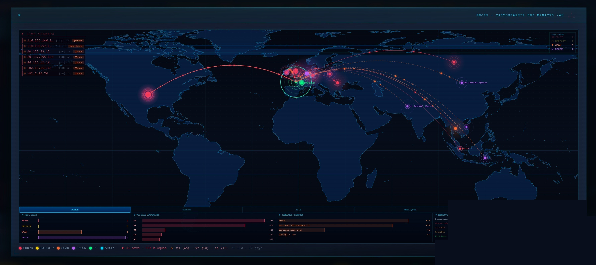
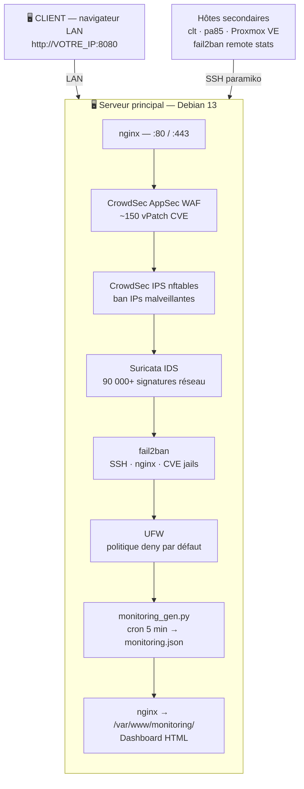
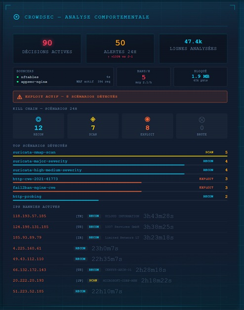
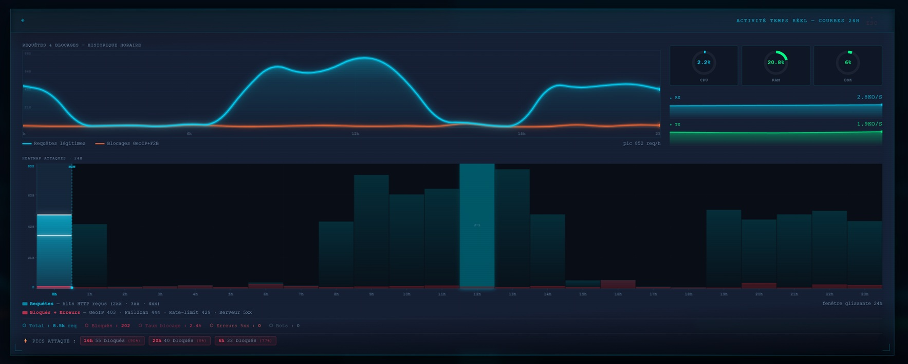
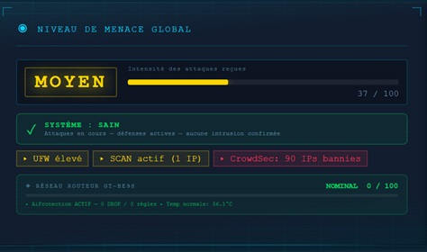
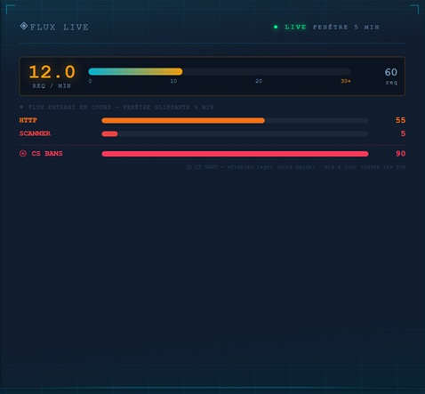
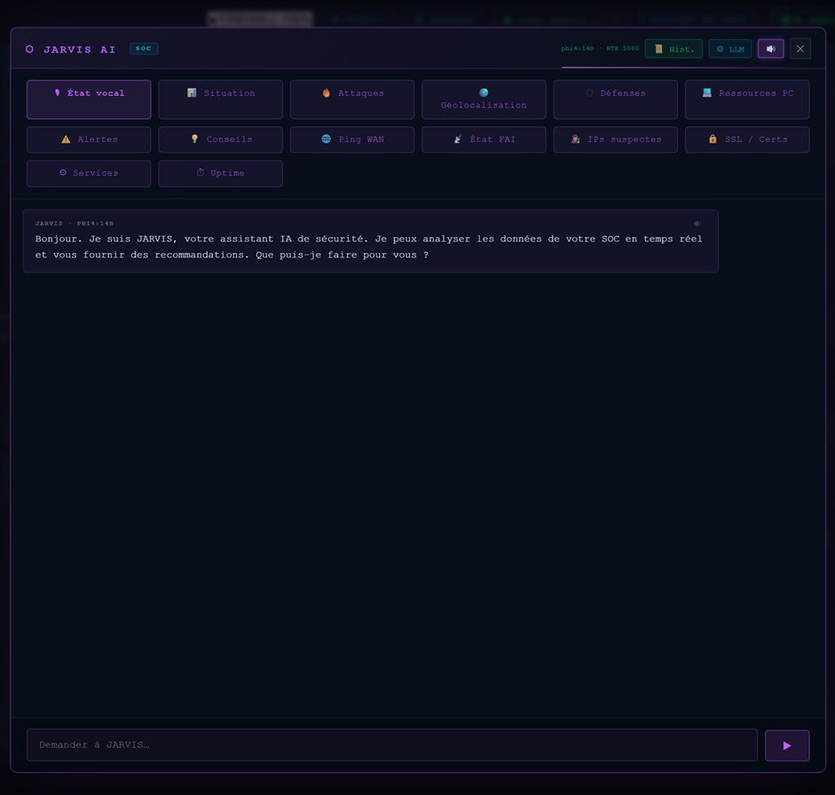
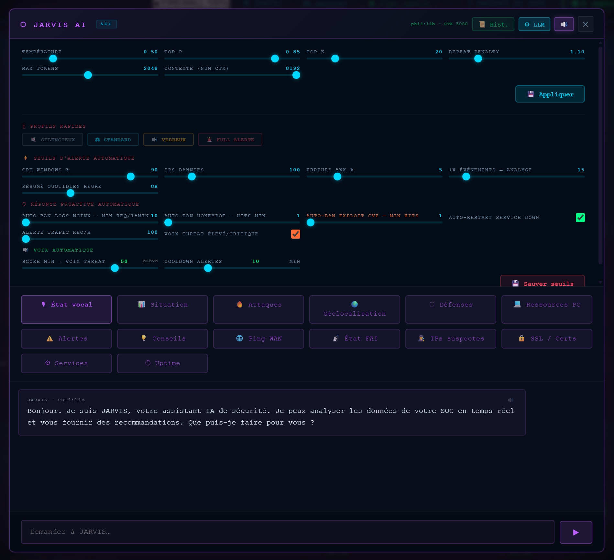
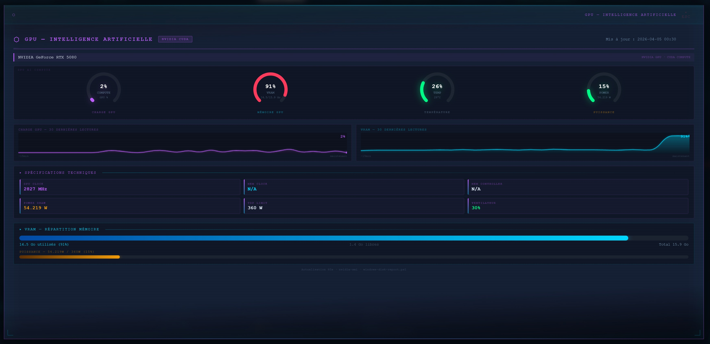

<div align="center">

  <br></br>

  <a href="https://github.com/0xCyberLiTech">
    
  </a>

  <br></br>

  <h2>Laboratoire numérique pour la cybersécurité, Linux & IT.</h2>

  <p align="center">
    <a href="https://0xcyberlitech.github.io/">
      
    </a>
    <a href="https://github.com/0xCyberLiTech">
      
    </a>
    <a href="https://github.com/0xCyberLiTech/SOC/releases/latest">
      
    </a>
    <a href="https://github.com/0xCyberLiTech/SOC/blob/main/CHANGELOG.md">
      
    </a>
    <a href="https://github.com/0xCyberLiTech?tab=repositories">
      
    </a>
  </p>

</div>

<div align="center">
  
</div>

<div align="center">
  <p>
    <strong>Cybersécurité</strong>  • <strong>Linux Debian</strong>  • <strong>Sécurité informatique</strong> 
  </p>
</div>

<div align="center">
  <br/>
  
</div>

---

<div align="center">

## À propos & Objectifs.

</div>

Passionné de cybersécurité défensive et d'automatisation système, j'ai construit ce tableau de bord SOC pour surveiller mon infrastructure homelab en conditions réelles — **24/7, en production**, depuis plusieurs mois.

Ce n'est pas un projet de démonstration. C'est un SOC opérationnel face à de vraies attaques quotidiennes : scans massifs, tentatives d'intrusion SSH, exploits web automatisés. Chaque tuile, chaque alerte, chaque graphique est le fruit d'itérations successives confrontées à la réalité du terrain.

L'infrastructure repose sur un hyperviseur **Proxmox VE** hébergeant plusieurs VMs Debian 13 — nginx en reverse proxy, **CrowdSec AppSec WAF** (~150 vPatch CVE actifs), **Suricata IDS** (90 000+ signatures), **fail2ban** sur 4 hôtes, UFW en politique deny-default. Le tout supervisé par un dashboard monolithique HTML/CSS/JS de **27 tuiles**, sans aucune dépendance externe.

> **Ce projet a été conçu et développé en collaboration avec [Claude AI](https://claude.ai) (Anthropic) — Claude Code.**
> De l'architecture initiale aux algorithmes de détection de pics réseau, des scripts de déploiement automatisé aux 27 tuiles de surveillance — l'IA a joué le rôle de co-développeur à chaque étape. Cette collaboration homme-IA illustre ce que l'on peut construire seul, rapidement, à un niveau professionnel.

Le contenu est structuré pour répondre aux besoins de :
- 🛡️ **Professionnels IT & Sysadmins** — déployer une stack sécurité complète et opérationnelle
- 🎓 **Étudiants en cybersécurité** — comprendre la chaîne défensive de bout en bout
- 🔍 **Passionnés de homelab** — aller au-delà des tutos, construire du réel
- 🤖 **Explorateurs IA** — voir comment Claude AI accélère le développement technique

---

## Sommaire

<div align="center">
<table border="0" width="700">
  <tr>
    <td align="center" width="175"><a href="#vue-densemble">Vue d'ensemble</a></td>
    <td align="center" width="175"><a href="#architecture">Architecture</a></td>
    <td align="center" width="175"><a href="#screenshots">Screenshots</a></td>
    <td align="center" width="175"><a href="#déploiement-rapide">Installation</a></td>
  </tr>
  <tr>
    <td align="center"><a href="#guide-dinstallation--étape-par-étape">Guide complet</a></td>
    <td align="center"><a href="#27-tuiles-de-surveillance">27 Tuiles</a></td>
    <td align="center"><a href="#stack-technique">Stack technique</a></td>
    <td align="center"><a href="#intégration-jarvis-ia">Intégration JARVIS</a></td>
  </tr>
</table>
</div>

---

## Vue d'ensemble

**SOC Dashboard** est un tableau de bord de sécurité complet, opérationnel en production 24/7.

| Capacité | Détail |
|----------|--------|
| **Périmètre** | CrowdSec AppSec WAF (~150 vPatch CVE) + IPS nftables |
| **IDS** | Suricata — 90 000+ signatures, alertes classées par sévérité |
| **Brute Force** | fail2ban — 4 hôtes (srv-ngix, clt, pa85, Proxmox) |
| **Firewall** | UFW — politique deny par défaut, matrice de règles |
| **Kill Chain** | MITRE ATT&CK — IPs actives par stage d'attaque |
| **Dashboard** | 27 tuiles — HTML/CSS/JS monolithique — zéro dépendance externe |
| **IA** | JARVIS intégré — analyse LLM, ban auto, alertes vocales |

---

## Architecture



---

## Screenshots

### Carte mondiale des attaques

<div align="center">
  
  <br/><sub>Tuile <b>CARTE MONDIALE</b> — géolocalisation des IPs bannies, arcs d'attaque, clustering par pays</sub>
</div>

<br/>

### CrowdSec & Activité 24h

<table border="0" cellspacing="0" cellpadding="8">
  <tr>
    <td width="42%">
      
      <p align="center"><sub>Tuile <b>CROWDSEC</b> — 90 décisions actives, Kill Chain scénarios, IPs bannies avec durée</sub></p>
    </td>
    <td width="58%">
      
      <p align="center"><sub>Tuile <b>ACTIVITÉ 24H</b> — requêtes légitimes vs blocages CrowdSec, histogramme horaire</sub></p>
    </td>
  </tr>
</table>

### Threat Score & Flux live

<table border="0" cellspacing="0" cellpadding="8">
  <tr>
    <td width="55%">
      
      <p align="center"><sub>Tuile <b>THREAT SCORE</b> — score 0-100 sur 14 sources, niveau MOYEN/ÉLEVÉ/CRITIQUE</sub></p>
    </td>
    <td width="45%">
      
      <p align="center"><sub>Tuile <b>FLUX LIVE</b> — req/min fenêtre glissante 5 min, HTTP · Scanner · CS Bans</sub></p>
    </td>
  </tr>
</table>

### Intégration JARVIS IA

<table border="0" cellspacing="0" cellpadding="8">
  <tr>
    <td width="50%">
      
      <p align="center"><sub>Tuile <b>JARVIS IA</b> — quick prompts SOC, analyse LLM en temps réel, actions proactives</sub></p>
    </td>
    <td width="50%">
      
      <p align="center"><sub>Tuile <b>JARVIS SETTINGS</b> — seuils auto-engine, ban auto, restart services, alertes vocales</sub></p>
    </td>
  </tr>
</table>

### GPU — Intelligence Artificielle

<div align="center">
  
  <br/><sub>Tuile <b>GPU IA</b> — RTX 5080 · usage CUDA, VRAM, température, sparklines 10 dernières secondes</sub>
</div>

---

## Guide d'installation — étape par étape

<table>
  <tr>
    <th>Étape</th>
    <th>Description</th>
    <th>Guide</th>
  </tr>
  <tr>
    <td align="center"><b>01</b></td>
    <td>Prérequis, OS, SSH, UFW de base</td>
    <td><a href="./docs/01-PREREQUIS.md">→ Prérequis</a></td>
  </tr>
  <tr>
    <td align="center"><b>02</b></td>
    <td>nginx, virtual host, déploiement web</td>
    <td><a href="./docs/02-NGINX-WEB.md">→ nginx & Web</a></td>
  </tr>
  <tr>
    <td align="center"><b>03</b></td>
    <td>CrowdSec IPS + AppSec WAF (~150 vPatch CVE)</td>
    <td><a href="./docs/03-CROWDSEC.md">→ CrowdSec</a></td>
  </tr>
  <tr>
    <td align="center"><b>04</b></td>
    <td>Suricata IDS (90K+ signatures, alertes 24h)</td>
    <td><a href="./docs/04-SURICATA.md">→ Suricata</a></td>
  </tr>
  <tr>
    <td align="center"><b>05</b></td>
    <td>fail2ban multi-hôtes (SSH, nginx, CVE jails)</td>
    <td><a href="./docs/05-FAIL2BAN.md">→ fail2ban</a></td>
  </tr>
  <tr>
    <td align="center"><b>06</b></td>
    <td>Collecte des données — monitoring_gen.py</td>
    <td><a href="./docs/06-COLLECTE-MONITORING.md">→ Collecte</a></td>
  </tr>
  <tr>
    <td align="center"><b>07</b></td>
    <td>Dashboard HTML + déploiement final</td>
    <td><a href="./docs/07-DASHBOARD.md">→ Dashboard</a></td>
  </tr>
</table>

---

## Déploiement rapide

```bash
# 1. Cloner
git clone https://github.com/0xCyberLiTech/SOC.git
cd SOC

# 2. Suivre le guide étape par étape
# Commencer par : docs/01-PREREQUIS.md

# 3. Déployer le dashboard
scp -P 2222 dashboard/monitoring-index.html user@VOTRE_IP:/var/www/monitoring/index.html
```

```
✔  SOC Dashboard disponible sur  →  http://VOTRE_IP:8080
```

---

## 27 Tuiles de surveillance

<details>
<summary>Voir toutes les tuiles</summary>

<br/>

| # | Tuile | Données surveillées |
|---|-------|---------------------|
| 01 | **KILL CHAIN** | MITRE ATT&CK — IPs actives par stage d'attaque |
| 02 | **CROWDSEC IPS** | Décisions nftables, scénarios, bans actifs |
| 03 | **CROWDSEC AppSec** | Requêtes bloquées WAF, vPatch CVE actifs |
| 04 | **SURICATA IDS** | Alertes sév.1 / sév.2 sur 24h |
| 05 | **FAIL2BAN** | 4 hôtes — jails actives, IPs bannies |
| 06 | **UFW FIREWALL** | Matrice règles, anomalies détectées |
| 07 | **HONEYPOT** | Tentatives sur ports non exposés |
| 08 | **CVE WATCH** | Feed CVE récentes (NVD) |
| 09 | **ROUTEUR** | WAN tx/rx, conntrack, flux réseau |
| 10 | **FREEBOX DELTA** | BOX/WAN/SFP, graphiques, alertes trafic |
| 11 | **NGINX TRAFIC** | Requêtes 24h, erreurs, GeoIP |
| 12 | **PROTOCOLES ACTIFS** | Répartition protocoles/ports (live donut) |
| 13 | **CARTE MONDIALE** | Géolocalisation attaques — arcs animés |
| 14 | **PROXMOX VE** | CPU/RAM, VMs, sparklines |
| 15 | **WINDOWS** | Disques, GPU, sauvegarde |
| 16 | **SSH** | Sessions actives, uptimes |
| 17 | **SERVICES** | État services critiques |
| 18 | **CRONS** | Tâches planifiées |
| 19 | **MISES À JOUR** | Paquets en attente |
| 20 | **THREAT SCORE** | Score 0-100 sur 14 sources |
| 21 | **JARVIS IA** | Actions proactives, quick prompts, auto-engine |
| 22 | **ALERTES TRAFIC** | Pics WAN, historique 24h, détection d'anomalies |
| 23 | **FLUX LIVE** | req/min fenêtre glissante 5 min |
| 24 | **ACTIVITÉ 24H** | Volume d'attaques par heure, histogramme |
| 25 | **GPU IA** | RTX — usage CUDA, VRAM, température |
| 26 | **GeoIP TOP** | Top pays attaquants sur 24h |
| 27 | **HISTORIQUE** | Graphes CPU/RAM/réseau sur 24h |

</details>

---

## Stack technique

<div align="center">

| Couche | Technologie | Rôle |
|--------|------------|------|
| Sécurité périmètre | CrowdSec AppSec + IPS | WAF ~150 vPatch CVE + ban IPs nftables |
| IDS | Suricata | 90 000+ signatures réseau |
| Brute Force | fail2ban | SSH/nginx/CVE — 4 hôtes |
| Firewall | UFW | Politique deny par défaut |
| Reverse proxy | nginx | TLS, rate limiting, GeoIP |
| Collecte | Python 3.11 — monitoring_gen.py | Cron 5 min → monitoring.json |
| Frontend | HTML/CSS/JS monolithique | Zéro dépendance externe |
| Virtualisation | Proxmox VE | Hyperviseur VMs |
| IA | JARVIS (Ollama local) | Analyse LLM, ban auto, alertes vocales |

</div>

---

## Intégration JARVIS IA

Le dashboard SOC s'intègre avec [JARVIS](https://github.com/0xCyberLiTech/JARVIS) pour :

- **Analyser** les logs et alertes via LLM local (Ollama — phi4-reasoning)
- **Bannir automatiquement** les IPs si le seuil d'attaque est dépassé (via CrowdSec SSH)
- **Redémarrer** les services critiques détectés DOWN
- **Alerter vocalement** si le threat score atteint ÉLEVÉ ou CRITIQUE
- **Journaliser** chaque action SOC avec horodatage dans l'onglet SOC

---

## Sécurité — ce qui n'est pas dans ce dépôt

```
✔  Aucune IP réelle — VOTRE_IP dans tous les exemples
✔  Aucun token, clé SSH ou mot de passe
✔  Aucun fichier JSON de monitoring (données live)
✔  Aucune donnée personnelle ou réseau privé
✔  Scripts fournis à titre d'exemple — adapter à votre infrastructure
```

---

<div align="center">
  <a href="https://github.com/0xCyberLiTech" target="_blank" rel="noopener">
    
  </a>
</div>

<div align="center">
  <b>🔒 Un guide proposé par <a href="https://0xcyberlitech.com/">0xCyberLiTech</a> • Pour des tutoriels accessibles à tous. 🔒</b>
</div>
