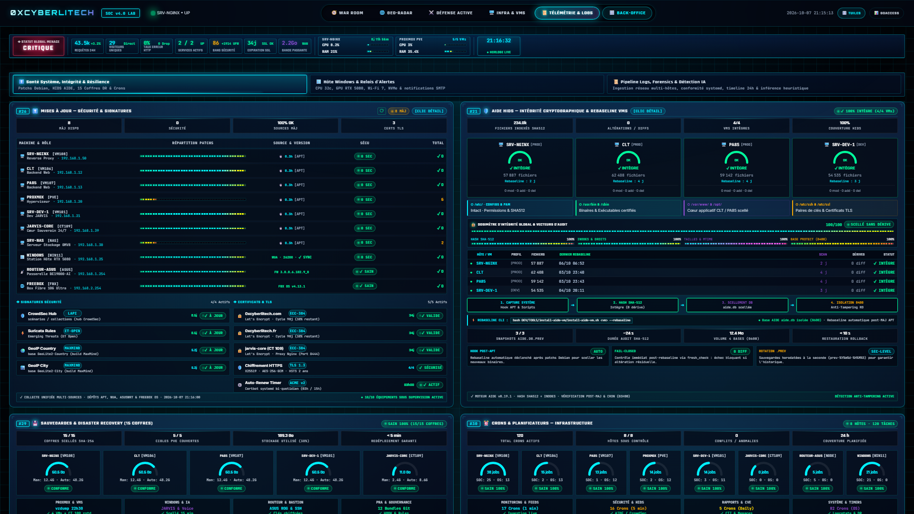

<div align="center">

  <br></br>

  <a href="https://github.com/0xCyberLiTech">
    
  </a>

  <br></br>

  <h2>SOC homelab · défense en profondeur · Kill Chain temps réel · IA intégrée</h2>

  <p align="center">
    <a href="https://0xcyberlitech.github.io/">
      
    </a>
    <a href="https://github.com/0xCyberLiTech">
      
    </a>
    <a href="https://github.com/0xCyberLiTech/SOC/tags">
      
    </a>
    <a href="https://github.com/0xCyberLiTech/SOC/blob/main/CHANGELOG.md">
      
    </a>
    <a href="https://github.com/0xCyberLiTech?tab=repositories">
      
    </a>
    <a href="https://github.com/0xCyberLiTech/SOC/graphs/contributors">
      
    </a>
  </p>

</div>

<div align="center">
  
</div>

<div align="center">
  <p>
    <strong>Cybersécurité défensive</strong>  &nbsp;•&nbsp; <strong>Homelab en production</strong>  &nbsp;•&nbsp; <strong>IA locale intégrée</strong> 
  </p>
</div>

> [!IMPORTANT]
> **Vitrine : la méthode est partagée, la reconstruction complète ne l'est pas.**
> Ce dépôt présente mon SOC homelab et **partage le framework de déploiement** (`deploy-soc.sh`, runbook, checklist) — la méthode est réutilisable. En revanche, **reconstruire CE SOC à l'identique n'est pas reproductible** depuis ce seul dépôt : configurations opérationnelles, règles complètes et sources du dashboard restent **privées** (sécurité, savoir protégé).

---

<div align="center">

### ⚡ LE COCKPIT TACTIQUE EN PRODUCTION — EXTREME HUD v5.5

[](assets/soc-cockpit-index.png)

*Interface de commandement unifiée Extreme HUD v5.5 — Vue War Room en production 24h/24 : télémétrie sub-200ms, jauges segmentées LED, rendu Vanilla natif et zéro dépendance externe.*

<br/>

<p align="center">
  
  
  
  
  
</p>

</div>

---

## 🗺️ Sommaire Interactif

1. 🎯 [Manifeste d'Ingénierie : L'Homelab Révolutionné](#1--manifeste-dingénierie--lhomelab-révolutionné)
2. 🔄 [Schéma Conceptuel Global : Le Cycle Nodal de Cyberdéfense](#2--schéma-conceptuel-global--le-cycle-nodal-de-cyberdéfense)
3. 🎛️ [Le Cockpit Extreme HUD & le Studio Back-Office](#3--le-cockpit-extreme-hud--le-studio-back-office)
4. 🌌 [Les Deux Moteurs Graphiques Canvas Haute Performance (3D & 2D)](#4--les-deux-moteurs-graphiques-canvas-haute-performance-3d--2d)
5. 🛡️ [La Cascade de Cyberdéfense en Profondeur & Détection-as-Code](#5--la-cascade-de-cyberdéfense-en-profondeur--détection-as-code)
6. 📐 [Dette Technique Zéro : La Règle d'Or du Plafond $\le 400$ Lignes](#6--dette-technique-zéro--la-règle-dor-du-plafond-le-400-lignes)
7. 🧪 [L'Armure Qualité : 19 Gardiens & Bancs Hostiles Niveaux 3 & 4](#7--larmure-qualité--19-gardiens--bancs-hostiles-niveaux-3--4)
8. 🤖 [Intelligence Artificielle Locale & Restitution Vocale Souveraine](#8--intelligence-artificielle-locale--restitution-vocale-souveraine)
9. 🖥️ [Topologie du Homelab en Production (Anonymisée)](#9--topologie-du-homelab-en-production-anonymisée)
10. 🔄 [Framework de Déploiement & Reproductibilité Méthodologique](#10--framework-de-déploiement--reproductibilité-méthodologique)

---

## 1. 🎯 Manifeste d'Ingénierie : L'Homelab Révolutionné

La majorité des homelabs s'appuient sur des interfaces génériques préemballées (*Grafana*, *Homepage*, *Dashy*) ou juxtaposent des services conteneurisés sans corrélation d'ensemble. **Ce projet prend le contre-pied absolu de cette approche.**

Bâti sous la gouvernance de la **Doctrine Universelle de l'Atelier 0xCyberLiTech**, ce SOC homelab est une plateforme de cyberdéfense sur mesure, conçue avec les standards de rigueur de l'aérospatiale et des infrastructures critiques :

| Dimension Clé | Homelab Conventionnel (99 %) | SOC Souverain 0xCyberLiTech (0,1 %) |
|:--------------|:-----------------------------|:-----------------------------------|
| **Environnement** | Lab isolé ou simulation locale | **Production réelle 24h/24** exposée directement à Internet |
| **Interface & Rendu** | Templates Grafana lourds, 10 onglets ouverts | **Cockpit unifié Extreme HUD v5.5** en Vanilla JS natif (< 200 ms) |
| **Dette Technique** | Fichiers volumineux, scripts empilés sans tests | **Dette Zéro scellée** : 100 % des fichiers $\le 400$ lignes (Règle 14.7) |
| **Garantie Qualité** | Vérifications manuelles épisodiques | **19 Gardiens logiciels automatiques** + bancs E2E sous Edge réel |
| **Fiabilité des Données** | Métriques parfois devinées ou approximatives | **Déterminisme pur (< 200 ms)** : 0 hallucination sur les états réels |
| **Synthèse Vocale & IA** | LLM dans le cloud ou interfaces muettes | **Voix locale Antoine HD (MCI Windows direct)** + LLM local sur GPU |
| **Résilience Sinistre** | Sauvegardes manuelles non éprouvées | **Disaster Recovery automatisé** prêt à redéployer en 5 minutes |

---

## 2. 🔄 Schéma Conceptuel Global : Le Cycle Nodal de Cyberdéfense

Voici la mécanique d'ingénierie qui anime le SOC en continu : chaque paquet hostile entrant traverse une série de barrières déterministes, est corrélé par le moteur nodal XDR, déclenche la riposte en temps réel et informe l'opérateur vocalement et visuellement :

```
       [ CYBERESPACE EXTÉRIEUR : Scans, Bots, Exploits, Attaques C2 ]
                                      │
                                      ▼
┌───────────────────────────────────────────────────────────────────────────┐
│ 1. CAPTEURS PÉRIPHÉRIQUES & FILTRAGE FRONTAL                              │
│ • Pare-feu Routeur Dédié Wi-Fi 7 (DPI)  • UFW & filtrage GeoIP            │
│ • CrowdSec AppSec WAF (vpatch CVE)      • Suricata IDS 7 (AF_PACKET)      │
│ • Confinement AppArmor & Fail2ban       • Base d'intégrité AIDE HIDS (4VM)│
└─────────────────────────────────────┬─────────────────────────────────────┘
                                      │  Logs structurés & Événements EVE JSON
                                      ▼
┌───────────────────────────────────────────────────────────────────────────┐
│ 2. PIPELINE DE NORMALISATION & MOTEUR SIGMA VERSIONNÉ                     │
│ • Parsing haute performance          • Géolocalisation GeoIP2 MaxMind     │
│ • Enrichissement CTI & Bad IPs       • Cycle Sigma : alert → dry-run → ban│
│ • Classification 5 Stades MITRE      • Vérification Rail RFC1918 (0 fuite)│
└─────────────────────────────────────┬─────────────────────────────────────┘
                                      │  Payload unifié monitoring.json
                                      ▼
┌───────────────────────────────────────────────────────────────────────────┐
│ 3. MOTEUR NODAL XDR & MATRICE DE MENACE (THREATSCORE 0-100)               │
│ • Corrélation cross-sources temps réel (WAF + IDS + HIDS + Syslog)        │
│ • Calcul dynamique du ThreatScore (Faible / Moyen / Élevé / Critique)     │
│ • Détection des attaques lentes (/24 sur 14 jours) & IoC post-intrusion   │
└─────────────────────────────────────┬─────────────────────────────────────┘
                                      │
            ┌─────────────────────────┴─────────────────────────┐
            ▼                                                   ▼
┌───────────────────────────────────────┐   ┌───────────────────────────────────┐
│ 4A. RESTITUTION VISUELLE TACTIQUE     │   │ 4B. RIPOSTE & SOAR VOCAL DIRECT   │
│ • Cockpit Extreme HUD (38 tuiles)     │   │ • Auto-ban Kernel-Space nftables  │
│ • Corridor 3D Kill Chain (Canvas)     │   │ • Voix native Windows Antoine HD  │
│ • Geo-Radar 2D balistique mondial     │   │ • Fast-Path déterministe < 200 ms │
│ • Studio Back-Office modulable        │   │ • Analyse forensique LLM locale   │
└───────────────────────────────────────┘   └───────────────────────────────────┘
```

---

## 3. 🎛️ Le Cockpit Extreme HUD & le Studio Back-Office

Le poste de commandement repose sur une séparation hermétique entre la **façade opérationnelle de surveillance (Cockpit)** et le **moteur d'agencement modulaire (Studio Back-Office)**.

<div align="center">

| Vue Opérationnelle — War Room Principale | Studio Back-Office — Catalogue & Étagères |
|:----------------------------------------:|:-----------------------------------------:|
| [](assets/soc-cockpit-index.png) | [](assets/soc-studio-backoffice.png) |
| *Affichage temps réel haute densité · Contraste tactique* | *Personnalisation en direct · Hauteurs d'étagères modulables* |

</div>

### Pédagogie de l'Architecture UI :
* **Organisation en 5 Espaces Opérationnels et 13 Sous-Onglets :**
  1. *Vue d'ensemble (War Room) :* Dosimètre cyber, corridors de menaces, indicateurs vitaux et matrice de réaction.
  2. *Cyberdéfense :* Chaîne active à 9 couches, WAF CrowdSec, Suricata IDS, Fail2ban, Couverture par Zone et règles Sigma.
  3. *Cartographie :* Geo-Radar 2D vectoriel, globe balistique et répartition géographique des attaquants.
  4. *Infrastructure :* Santé de l'hyperviseur Proxmox VE, intégrité AIDE HIDS (4 VMs), suivi des crons et connectivité réseau.
  5. *Télémétrie XDR :* Logigramme nodal, corrélation multi-sources et historique forensique sur 30 jours.
* **Le Studio Back-Office Souverain :**
  * **10 Gabarits Étalons (G-1 à G-10) :** Permettent d'adapter la structure des écrans à n'importe quelle disposition physique.
  * **Élasticité Inviolable des Étagères :** L'opérateur module librement la hauteur des rangées (`row1`, `row2`), déplace les tuiles par glisser-déposer sans rechargement de page et inspecte chaque tuile au survol (*Quick-Peek*).
  * **Design System A11Y Tactique :** Contrastes ultra-nets conçus pour une lisibilité immédiate, absence d'éléments parasites en production et bargraphes segmentés LED étalons.

---

## 4. 🌌 Les Deux Moteurs Graphiques Canvas Haute Performance (3D & 2D)

Pour garantir une fréquence d'affichage fluide à **60 FPS constants sans alourdir le processeur**, le SOC intègre deux moteurs de rendu codés en **HTML5 Canvas 2D natif pur** (zéro bibliothèque 3D externe) :

<div align="center">

| 🚀 Corridor Spatial 3D Kill Chain | 🗺️ Cartographie Mondiale Vectorielle 2D |
|:---------------------------------:|:----------------------------------------:|
| [](assets/soc-killchain-3d.png) | [](assets/soc-geomap-2d.png) |
| *Projection perspective 3D · Sol Tron · Pluie Matrix* | *Projection vectorielle · Arcs d'attaque balistiques* |

</div>

### Détails Techniques des Moteurs Graphiques :
* **Le Corridor 3D Kill Chain :**
  * **Moteur de projection perspective mathématique :** Matrice de rotation 3D sans WebGL lourd, sol Tron rétro-éclairé, pluie matricielle interpolée en arrière-plan et onde EMP périodique.
  * **Cinématique MITRE ATT&CK :** Les 5 stades d'intrusion (Reconnaissance → Scan → Exploit → Brute-force → Neutralisé) sont matérialisés par des monolithes holographiques et des balises spatiales WAN / Citadelle.
  * **Fiche d'Investigation Forensique :** Un simple clic sur un vecteur ouvre la modale d'analyse détaillée avec scoring 5 sources et bouton de neutralisation instantanée.
* **Le Geo-Radar 2D Geomap :**
  * **Projection vectorielle pure :** Cartographie mondiale vectorisée avec coordonnées des centroïdes sans distorsion de bordure.
  * **Convergence Balistique :** Traçage d'arcs d'attaque courbés animés reliant en direct la provenance géographique de l'attaquant au nœud défensif du homelab.
  * **Double Fenêtre Temporelle :** Bascule instantanée entre la vision tactique immédiate (15 minutes) et la consolidation stratégique (24 heures glissantes).

---

## 5. 🛡️ La Cascade de Cyberdéfense en Profondeur & Détection-as-Code

Chaque flux réseau externe entrant doit franchir **cinq cercles de protection concentriques** avant de pouvoir interagir avec le moindre service :

```
FLUX WAN ENTRANT (Internet brut)
    │
    ▼
┌────────────────────────────────────────────────────────────────────────┐
│ [ CERCLE 1 : FILTRAGE PHYSIQUE & MATÉRIEL ]                            │
│ Routeur Dédié Wi-Fi 7 (AiProtection DPI) + Pare-feu UFW + GeoIP Block  │
└───────────────────────────────────┬────────────────────────────────────┘
                                    │
                                    ▼
┌────────────────────────────────────────────────────────────────────────┐
│ [ CERCLE 2 : WAF & PROTECTION COMPORTEMENTALE APPLICATIVE ]            │
│ CrowdSec AppSec WAF (~180 scénarios vpatch CVE) + Bouncer Kernel-Space │
└───────────────────────────────────┬────────────────────────────────────┘
                                    │
                                    ▼
┌────────────────────────────────────────────────────────────────────────┐
│ [ CERCLE 3 : DÉTECTION PASSIVE & ANALYSE PROTOCOLAIRE ]                │
│ Suricata IDS 7 (AF_PACKET · ~90 000 signatures Emerging Threats)       │
└───────────────────────────────────┬────────────────────────────────────┘
                                    │
                                    ▼
┌────────────────────────────────────────────────────────────────────────┐
│ [ CERCLE 4 : DÉTECTION-AS-CODE ]                                       │
│ Moteur Sigma Versionné (Cycle strict : alert-only → dry-run → enforce) │
└───────────────────────────────────┬────────────────────────────────────┘
                                    │
                                    ▼
┌────────────────────────────────────────────────────────────────────────┐
│ [ CERCLE 5 : HIDS, ISOLATION & INTÉGRITÉ SYSTÈME ]                     │
│ Fail2ban (multi-jails) + AppArmor (profils stricts) + AIDE HIDS (4VMs) │
└───────────────────────────────────┬────────────────────────────────────┘
                                    │
                                    ▼
TRAFIC LÉGITIME ADMIS ──────────────┴───────→ Reverse Proxy Nginx & Services Internes
```

<div align="center">

| Chaîne de Défense Active & Filtrage WAF | Télémétrie XDR Nodal & Corrélation |
|:---------------------------------------:|:----------------------------------:|
| [](assets/soc-defense-chain.png) | [](assets/soc-xdr-nodal.png) |
| *9 couches défensives actives en temps réel* | *Logigramme nodal et fusion des alertes cross-hosts* |

</div>

### Principes de Détection-as-Code :
* **Maturité Éprouvée des Règles Sigma :** Une signature n'est jamais déployée à l'aveugle. Elle passe par un sas `alert-only` (observation), puis `dry-run` (simulation de ban), et n'est promue en `enforce` (blocage réel) qu'après la preuve formelle de zéro faux positif.
* **Corrélation Multi-Moteurs XDR :** Le moteur croise les événements réseau de Suricata avec les logs HTTP de Nginx et les détections d'authentification de Fail2ban pour identifier les assauts coordonnés.
* **Surveillance HIDS AIDE sur 4 VMs :** Un scan cryptographique quotidien vérifie l'intégrité de plus de 49 000 fichiers système sur l'ensemble des machines virtuelles, interdisant toute altération silencieuse post-compromission.

---

## 6. 📐 Dette Technique Zéro : La Règle d'Or du Plafond $\le 400$ Lignes

L'Atelier 0xCyberLiTech applique une doctrine d'ingénierie formelle : **le refus absolu des fichiers volumineux et des monolithes incontrôlables** (Règle 14.7 de la Doctrine Universelle).

* **Modularité Pure par Caissons Étanches :**
  Chaque fonctionnalité est scindée en modules étanches et découplés appliquant le principe de responsabilité unique (*Single Responsibility Principle*) :
  * Contrôleur maître et cycle de vie (`mon-composant.js`)
  * Composants d'interface et modales (`mon-composant-components.js` / `*-modal.js`)
  * Moteur de calcul ou algorithme de rendu (`mon-composant-engine.js` / `*-render.js`)
* **100 % des Fichiers Conformes :**
  Tous les fichiers JavaScript du dashboard et tous les scripts de maintenance (Bash et Python) respectent rigoureusement le plafond strict de **400 lignes maximum**.
* **Le Verrou Mécanique Déterministe :**
  Le gardien logiciel [`soc_modules_ceiling_guard.py`](file:///D:/0xCyberLiTech/DEV/TOOLS/soc-modules-ceiling-guard/soc_modules_ceiling_guard.py) scanne chaque fichier du projet. Si une modification ou un ajout tente de dépasser les 400 lignes, **le pipeline CI/CD bloque immédiatement le commit**.

---

## 7. 🧪 L'Armure Qualité : 19 Gardiens & Bancs Hostiles Niveaux 3 & 4

Aucune décision technique ne repose sur de simples suppositions. Tout est validé par des **preuves mécaniques déterministes** avant toute mise en production :

| Gardien / Banc d'Épreuve | Périmètre d'Action | Exigence Inviolable |
|:-------------------------|:-------------------|:-------------------:|
| **Suite Gardienne Maîtresse** | 19 outils automatisés (syntaxe, linters ruff/eslint, intégrité, parité) | **19 / 19 GO (100% VERT)** |
| **Plafond Volumétrique** | Scan de l'ensemble des fichiers JS, Python et Shell du SOC | **0 fichier > 400 lignes** |
| **Bancs Hostiles Niveau 3** | Tests aux limites avec payloads malformés, stress canvas, valeurs nulles/extrêmes | **100 % de succès** |
| **Bancs E2E Niveau 4 (Edge)** | Robotisation automatisée sous Microsoft Edge Headless réel (clics, modales, DOM) | **0 erreur JS console** |
| **Parité Tripartite** | Contrôle cryptographique au bit près (Atelier D: ➔ Sandbox Staging ➔ Production Nginx) | **100 % aligné (0 dérive)** |
| **Gardiens Anti-Fuite** | Détection automatique des identifiants et des adresses IP internes privées | **0 fuite dans les dépôts publics** |

---

## 8. 🤖 Intelligence Artificielle Locale & Restitution Vocale Souveraine

Pour assister l'opérateur dans la prise de décision rapide, le SOC intègre une architecture cognitive locale articulée autour de **l'assistant JARVIS / Hermès** :

* **Fast-Path Déterministe (< 200 ms) :**
  Toutes les requêtes relatives à l'état des machines, à la charge CPU/RAM, aux adresses IP neutralisées ou aux sauvegardes sont traitées par du code machine direct. **Le modèle de langage n'intervient jamais sur les métriques factuelles**, éliminant tout risque d'hallucination.
* **Passerelle Vocale Directe Windows MCI (Antoine HD) :**
  Les alertes de criticité élevée et les rapports de situation sont verbalisés en temps réel directement sur les haut-parleurs de l'opérateur via le moteur audio natif MCI de Windows, propulsé par la voix naturelle d'Antoine HD.
* **Expertise Forensique Sémantique :**
  Un modèle de langage local (12B) déployé sur conteneur dédié avec accélération matérielle GPU est mobilisé à la demande pour analyser la charge utile des attaques complexes et générer des résumés de corrélation contextuelle.

---

## 9. 🖥️ Topologie du Homelab en Production (Anonymisée)

L'infrastructure physique et virtuelle est segmentée sous hyperviseur bare-metal de classe entreprise :

```
                       [ ACCÈS INTERNET FIBRE ]
                                  │
                                  ▼
               ┌─────────────────────────────────────┐
               │     Routeur Dédié Wi-Fi 7 ROG       │
               │   Pare-feu SPI · AiProtection DPI   │
               └──────────────────┬──────────────────┘
                                  │
          ┌───────────────────────┴───────────────────────┐
          │                                               │
          ▼                                               ▼
┌───────────────────────────────────┐   ┌───────────────────────────────────┐
│     SERVEUR NAS MINISFORUM        │   │    HYPERVISEUR PROXMOX VE         │
│  OMV8 · Pools ZFS Miroirs Raid    │   │  Virtualisation Bare-Metal KVM    │
│  Snapshots Chiffrés · Coffres DR  │   │  Nœud Haute Disponibilité         │
└───────────────────────────────────┘   └─────────────────┬─────────────────┘
                                                          │
                    ┌─────────────────────────────────────┼─────────────────────────────────────┐
                    ▼                                     ▼                                     ▼
        ┌───────────────────────┐             ┌───────────────────────┐             ┌───────────────────────┐
        │  VM REVERSE PROXY WAF │             │  VM SANDBOX DE QUALIF │             │  CONTENEUR IA JARVIS  │
        │  Debian 13 · Nginx    │             │  Debian 13 · Staging  │             │  Debian 13 · Core     │
        │  CrowdSec · Suricata  │             │  Bancs Hostiles E2E   │             │  Fast-Path · TTS MCI  │
        │  Fail2ban · AIDE HIDS │             │  Qualification Dev    │             │  Ollama Mistral-Nemo  │
        └───────────────────────┘             └───────────────────────┘             └───────────────────────┘
```

| Nœud Réseau | Type d'Hôte | Système | Fonctions Principales |
|:------------|:-----------:|:-------:|:----------------------|
| **Hyperviseur Nodal** | Bare-metal | Proxmox VE | Virtualisation KVM, gestion des ponts réseau virtuels, monitoring ZFS |
| **Reverse Proxy WAF** | Machine Virtuelle | Debian 13 | Nginx frontal, CrowdSec WAF, Suricata IDS, Fail2ban, AIDE HIDS |
| **Plateforme Dev Sandbox** | Machine Virtuelle | Debian 13 | Environnement de qualification miroir, exécution des bancs d'essais hostiles |
| **Serveurs d'Applications** | Machines Virtuelles | Debian 13 | Services applicatifs durcis, profils AppArmor, forwarders rsyslog |
| **Cerveau IA JARVIS** | Conteneur Dédié | Debian 13 | Moteurs d'arbitrage déterministe, API TTS, exécution des modèles locaux |
| **Stockage & Coffres DR** | NAS Physique | OMV8 / ZFS | Stockage centralisé, réplication des pools ZFS, archives chiffrées |
| **Passerelle Réseau** | Routeur Dédié | Wi-Fi 7 / Merlin | Pare-feu frontal SPI, isolation VLANs, filtrage matériel DPI |

---

## 10. 🔄 Framework de Déploiement & Reproductibilité Méthodologique

Ce dépôt partage les scripts et guides méthodologiques permettant d'appréhender le déploiement et la résilience d'un SOC moderne :

* **[`DEPLOY/deploy-soc.sh`](DEPLOY/deploy-soc.sh) :** Script d'installation automatisé de la stack logicielle (Debian 13) avec options d'exécution pas-à-pas et simulation préalable (`--dry-run`).
* **[`DEPLOY/create-archive.sh`](DEPLOY/create-archive.sh) & [`restore-soc.sh`](DEPLOY/restore-soc.sh) :** Chaîne de sauvegarde et de restauration complète validée lors d'exercices de sinistre réels (PRA en 5 minutes).
* **Sanctuarisation Stricte des Données Personnelles :** L'ensemble des configurations diffusées dans le dossier `CONFIGS/` est strictement anonymisé à l'aide de variables canoniques d'infrastructure (`<SRV-NGINX-IP>`, `<ROUTER-IP>`, `<LAN-CIDR>`), protégeant rigoureusement les données d'exploitation.

---

<div align="center">

<table>
<tr>
<td align="center"><b>🖥️ Infrastructure & Sécurité</b></td>
<td align="center"><b>💻 Développement & Web</b></td>
<td align="center"><b>🤖 Intelligence Artificielle</b></td>
</tr>
<tr>
<td align="center">
  <a href="https://www.kernel.org/"></a>
  <a href="https://www.debian.org"></a>
  <a href="https://www.gnu.org/software/bash/"></a>
  <br/>
  <a href="https://nginx.org"></a>
  <a href="https://git-scm.com"></a>
</td>
<td align="center">
  <a href="https://www.python.org"></a>
  <a href="https://flask.palletsprojects.com"></a>
  <a href="https://developer.mozilla.org/docs/Web/HTML"></a>
  <br/>
  <a href="https://developer.mozilla.org/docs/Web/CSS"></a>
  <a href="https://developer.mozilla.org/docs/Web/JavaScript"></a>
  <a href="https://code.visualstudio.com"></a>
</td>
<td align="center">
  <a href="https://ollama.com"></a>
  <br/><br/>
  <a href="https://anthropic.com"></a>
</td>
</tr>
</table>

<br/>

<sub>🔒 Projets proposés par <a href="https://github.com/0xCyberLiTech">0xCyberLiTech</a> · Développés en collaboration avec <a href="https://claude.ai">Claude AI</a> (Anthropic) 🔒</sub>

</div>
