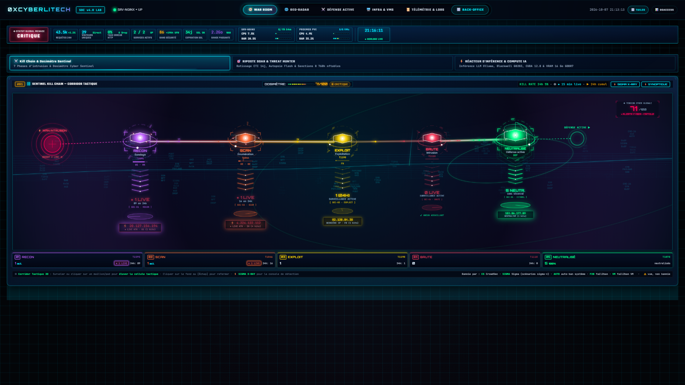
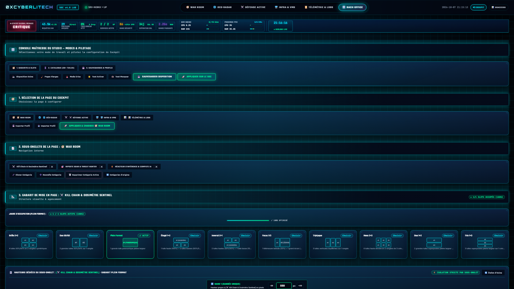
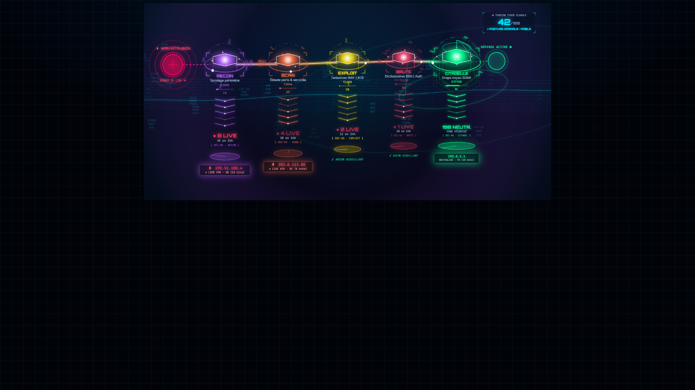
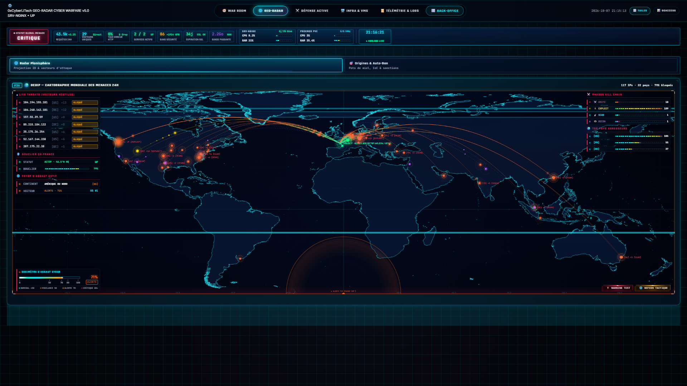
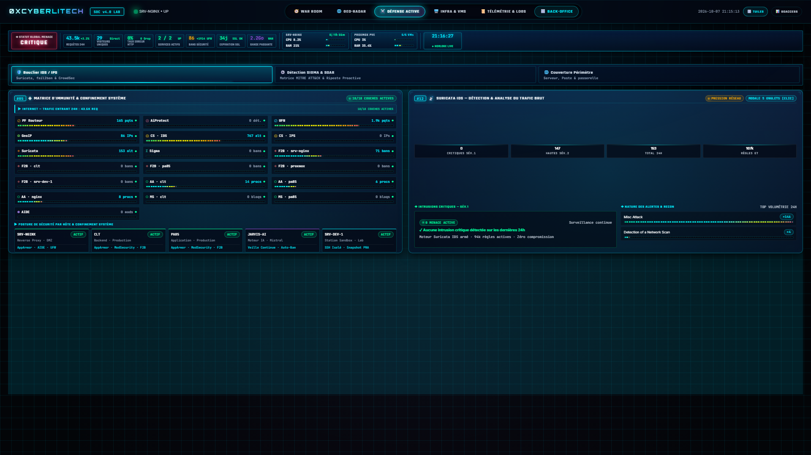

<div align="center">

  <br></br>

  <a href="https://github.com/0xCyberLiTech">
    
  </a>

  <br></br>

  <h2>SOC homelab · défense en profondeur · Kill Chain temps réel · IA intégrée</h2>

  <p align="center">
    <a href="https://0xcyberlitech.github.io/">
      
    </a>
    <a href="https://github.com/0xCyberLiTech">
      
    </a>
    <a href="https://github.com/0xCyberLiTech/SOC/tags">
      
    </a>
    <a href="https://github.com/0xCyberLiTech/SOC/blob/main/CHANGELOG.md">
      
    </a>
    <a href="https://github.com/0xCyberLiTech?tab=repositories">
      
    </a>
    <a href="https://github.com/0xCyberLiTech/SOC/graphs/contributors">
      
    </a>
  </p>

</div>

<div align="center">
  
</div>

<div align="center">
  <p>
    <strong>Cybersécurité défensive</strong>  &nbsp;•&nbsp; <strong>Homelab en production</strong>  &nbsp;•&nbsp; <strong>IA locale intégrée</strong> 
  </p>
</div>

> [!IMPORTANT]
> **Vitrine : la méthode est partagée, la reconstruction complète ne l'est pas.**
> Ce dépôt présente mon SOC homelab et **partage le framework de déploiement** (`deploy-soc.sh`, runbook, checklist) — la méthode est réutilisable. En revanche, **reconstruire CE SOC à l'identique n'est pas reproductible** depuis ce seul dépôt : configurations opérationnelles, règles complètes et sources du dashboard restent **privées** (sécurité, savoir protégé).

---

<div align="center">

### ⚡ LE COCKPIT TACTIQUE EN PRODUCTION — EXTREME HUD v5.5

<br/>

[](assets/soc-cockpit-index.png)

<br/>

*Poste de commandement unifié Extreme HUD v5.5 — Vue War Room en production 24h/24 : télémétrie sub-200ms, jauges segmentées LED normalisées, rendu Vanilla pur et zéro dépendance NPM.*

<br/>

<p align="center">
  
  
  
  
  
</p>

</div>

---

## 🗺️ Sommaire Pédagogique

- 🎯 [1. Manifeste d'Ingénierie : Pourquoi ce SOC surpasse le homelab ordinaire](#1--manifeste-dingénierie--pourquoi-ce-soc-surpasse-le-homelab-ordinaire)
- 🔄 [2. Schéma Conceptuel Global : Le Cycle Nodal de Cyberdéfense](#2--schéma-conceptuel-global--le-cycle-nodal-de-cyberdéfense)
- 🎛️ [3. Le Cockpit Extreme HUD & l'Ossature Modulaire](#3--le-cockpit-extreme-hud--lossature-modulaire)
- 🧩 [4. Le Studio Back-Office & la Structure en Caissons Aimantés](#4--le-studio-back-office--la-structure-en-caissons-aimantés)
- 🌌 [5. Les Moteurs Graphiques Canvas Dédiés (3D & 2D)](#5--les-moteurs-graphiques-canvas-dédiés-3d--2d)
- 🛡️ [6. La Cascade de Cyberdéfense en Profondeur & Détection-as-Code](#6--la-cascade-de-cyberdéfense-en-profondeur--détection-as-code)
- 📐 [7. Dette Technique Zéro : La Règle d'Or du Plafond $\le 400$ Lignes](#7--dette-technique-zéro--la-règle-dor-du-plafond-le-400-lignes)
- 🧪 [8. L'Armure Qualité : 19 Gardiens Déterministes & Bancs Hostiles Niveau 4](#8--larmure-qualité--19-gardiens-déterministes--bancs-hostiles-niveau-4)
- 🤖 [9. IA Défensive, Fast-Path (< 200 ms) & Synthèse Vocale Antoine HD](#9--ia-défensive-fast-path--200-ms--synthèse-vocale-antoine-hd)
- 🖥️ [10. Topologie & Matrice de l'Infrastructure Réelle (Anonymisée)](#10--topologie--matrice-de-linfrastructure-réelle-anonymisée)
- 🔄 [11. Framework de Déploiement & Disaster Recovery en 5 Minutes](#11--framework-de-déploiement--disaster-recovery-en-5-minutes)

---

## 1. 🎯 Manifeste d'Ingénierie : Pourquoi ce SOC surpasse le homelab ordinaire

Dans l'univers des homelabs, la quasi-totalité des projets repose sur des tableaux de bord génériques préemballés (*Grafana*, *Homepage*, *Dashy*) ou l'empilement de conteneurs disparates nécessitant 10 onglets ouverts. **Ce projet constitue une rupture méthodologique complète.**

Forgé selon les règles de la **Doctrine Universelle de l'Atelier 0xCyberLiTech**, ce SOC est un instrument de cyberdéfense sur mesure, développé avec les exigences de rigueur de l'aérospatiale et des systèmes d'armes critiques :

| Axe d'Évaluation | Homelab Traditionnel (99 %) | SOC Souverain 0xCyberLiTech (0,1 %) |
|:-----------------|:----------------------------|:-----------------------------------|
| **Environnement Réel** | Lab hors-sol, réseau simulé en chambre étanche | **Production réelle exposée 24h/24** aux assauts du cyberespace |
| **Moteur Graphique** | Tableaux de bord tiers lourds, latence élevée | **Cockpit Extreme HUD v5.5 natif Vanilla JS/CSS** (< 200 ms) |
| **Architecture du Code** | Monolithes historiques, scripts empilés sans tests | **Dette Zéro absolue : 100 % des fichiers $\le 400$ lignes** |
| **Assurance Qualité** | Contrôles visuels manuels épisodiques | **19 Gardiens CI/CD** + bancs d'épreuves sous **Microsoft Edge réel** |
| **Fiabilité Télémétrique** | Approximations ou suppositions du modèle IA | **Déterminisme pur** : 0 hallucination sur les métriques et machines |
| **Alerte & Accessibilité** | Notifications mail passives ou interfaces muettes | **Passerelle vocale directe Windows MCI** (voix naturelle Antoine HD) |
| **Résilience Sinistre** | Procédures de restauration théoriques | **Disaster Recovery automatisé** prêt à redéployer en 5 minutes |

---

## 2. 🔄 Schéma Conceptuel Global : Le Cycle Nodal de Cyberdéfense

Le système fonctionne comme un organisme cybernétique unifié. Chaque menace externe est captée, normalisée, corrélée et neutralisée de manière déterministe, pendant que l'opérateur en reçoit la restitution visuelle et vocale instantanée :

```
                  [ CYBERESPACE : Scans, Bots, Exploits, Attaques C2 ]
                                            │
                                            ▼
┌─────────────────────────────────────────────────────────────────────────────────────────┐
│ 1. CAPTEURS PÉRIPHÉRIQUES & FILTRAGE FRONTAL                                            │
│ • Pare-feu Routeur Dédié Wi-Fi 7 (DPI)          • Filtrage UFW & blocage GeoIP MaxMind  │
│ • CrowdSec AppSec WAF (~180 règles vpatch CVE)  • Suricata IDS 7 (AF_PACKET kernel)     │
│ • Confinement d'accès AppArmor                  • Contrôle d'intégrité AIDE HIDS (4VMs) │
└───────────────────────────────────────────┬─────────────────────────────────────────────┘
                                            │ Flux d'événements et logs EVE JSON
                                            ▼
┌─────────────────────────────────────────────────────────────────────────────────────────┐
│ 2. PIPELINE DE NORMALISATION & MOTEUR SIGMA VERSIONNÉ                                   │
│ • Parsing haute performance multi-sources       • Enrichissement CTI & listes d'assaut  │
│ • Cycle Sigma : alert-only → dry-run → enforce  • Rail d'immunité RFC1918 (zéro fuite)  │
│ • Classification cinématique 5 stades MITRE     • Empreinte temporelle des attaques     │
└───────────────────────────────────────────┬─────────────────────────────────────────────┘
                                            │ Payload unifié monitoring.json
                                            ▼
┌─────────────────────────────────────────────────────────────────────────────────────────┐
│ 3. MOTEUR NODAL XDR & MATRICE DE MENACE (THREATSCORE 0-100)                             │
│ • Corrélation croisée temps réel (WAF + IDS + HIDS + Authentification multi-hôtes)      │
│ • Calcul instantané du ThreatScore (Faible / Moyen / Élevé / Critique)                  │
│ • Détection des campagnes lentes (/24 sur 14 jours) et IoC post-compromission           │
└───────────────────────────────────────────┬─────────────────────────────────────────────┘
                                            │
                    ┌───────────────────────┴───────────────────────┐
                    ▼                                               ▼
┌───────────────────────────────────────────────┐   ┌─────────────────────────────────────┐
│ 4A. RESTITUTION VISUELLE TACTIQUE             │   │ 4B. RIPOSTE AUTOMATIQUE & IA SOAR   │
│ • Cockpit Extreme HUD (catalogue de tuiles)   │   │ • Bannissement kernel-space nftables│
│ • Corridor 3D Kill Chain (HTML5 Canvas pur)   │   │ • Passerelle vocale Windows MCI     │
│ • Geo-Radar 2D balistique mondial             │   │ • Restitution vocale Antoine HD     │
│ • Studio Back-Office à étagères modulables    │   │ • Fast-Path déterministe < 200 ms   │
└───────────────────────────────────────────────┘   └─────────────────────────────────────┘
```

---

## 3. 🎛️ Le Cockpit Extreme HUD & l'Ossature Modulaire

L'interface opérateur est conçue selon les principes ergonomiques d'un poste de pilotage militaire (**Extreme HUD**) :

* **Catalogue de Tuiles Métier Réparties sur 5 Espaces Opérationnels et 13 Sous-Onglets :**
  1. *Vue d'ensemble (War Room) :* Dosimètre cyber central, corridors tactiques et synthèse immédiate des défenses.
  2. *Cyberdéfense :* Cascade active multi-couches, WAF CrowdSec, Suricata IDS, Fail2ban, Couverture par Zone et règles Sigma.
  3. *Cartographie :* Geo-Radar vectoriel 2D, globe balistique et répartition géographique des flux d'attaque.
  4. *Infrastructure :* Hyperviseur Proxmox VE, intégrité AIDE HIDS (4 VMs), surveillance des crons et connectivité réseau.
  5. *Télémétrie XDR :* Logigramme nodal interactif, analyse forensique et historique 30 jours.
* **A11Y & Ergonomie Haute Visibilité :**
  * Conçu spécifiquement pour garantir une lisibilité optimale (contrastes francs, typographies taillées pour le monitoring tactique, suppression de tout élément parasite ou décoratif inutile).
  * **Standard Unique des Bargraphes Segmentés LED :** Chaque jauge (CPU, mémoire, saturation réseau, niveau de sévérité) respecte le conteneur étalon `.cyber-gauge-track` avec remplissage dynamique par classes CSS normalisées.

---

## 4. 🧩 Le Studio Back-Office & la Structure en Caissons Aimantés

Au cœur de l'Atelier réside une innovation d'agencement majeure : la **dissociation totale entre la logique des tuiles et leur conteneur physique**.

<br/>

[](assets/soc-studio-backoffice.png)

<br/>

*Le Studio Back-Office en action : pilotage direct des 10 gabarits étalons, élasticité des hauteurs d'étagères, catalogue dynamique et réagencement en-place zéro flash.*

### Les Principes Architecturaux de l'Ossature :
1. **Le Concept des Caissons Étanches :**
   Chaque tuile est encapsulée dans son propre composant indépendant. Une tuile ignore totalement l'existence des tuiles voisines et ne communique qu'avec l'état global normalisé (`monitoring.json`). Modifier, enrichir ou réécrire une tuile s'effectue sans aucun risque d'effet de bord sur le reste du Cockpit.
2. **La Grille Aimantée & les 10 Gabarits Étalons (G-1 à G-10) :**
   Le Studio propose 10 patrons de mise en page pré-calibrés pour s'adapter à toutes les résolutions d'écran tactiques (écrans ultra-larges, configurations multi-moniteurs ou affichages déportés).
3. **Élasticité Souveraine des Étagères :**
   L'opérateur contrôle au pixel près la hauteur des rangées d'étagères (`row1`, `row2`). Les compteurs de hauteur s'adaptent dynamiquement, permettant un redimensionnement fluide en direct.
4. **Catalogue Dynamique & Quick-Peek :**
   Les tuiles non assignées sont stockées dans une réserve vivante. Le survol d'une tuile dans le catalogue déclenche un aperçu instantané haute fidélité (*Quick-Peek*), permettant de valider son rendu avant toute insertion.

---

## 5. 🌌 Les Deux Moteurs Graphiques Canvas Dédiés (3D & 2D)

Pour obtenir une performance d'affichage absolue à **60 FPS constants sans mobiliser de bibliothèques 3D externes gourmandes**, le SOC s'appuie sur deux moteurs graphiques natifs développés en **HTML5 Canvas 2D pur** :

<br/>

### 🚀 A. Le Corridor 3D Kill Chain

[](assets/soc-killchain-3d.png)

*Moteur de perspective 3D temps réel : sol Tron rétro-éclairé, pluie Matrix, balises WAN/Citadelle, onde EMP, réticules Aegis et traçage cinématique des 5 stades MITRE ATT&CK.*

* **Projection Perspective Mathématique :** Modélisation d'un corridor spatial infini avec ligne d'horizon dynamique, calcul de profondeur par matrice matricielle pure sans dépendance WebGL.
* **Cinématique MITRE ATT&CK :** Les 5 maillons d'intrusion (*Reconnaissance → Scan → Exploit → Brute-force → Neutralisé*) sont matérialisés par des monolithes holographiques 3D extrudés, entourés d'anneaux orbitaux et de particules photoniques.
* **Investigation Forensique au Clic :** Un clic sur un vecteur ouvre instantanément une fiche d'analyse complète : réputation IP, historique 30 jours, décision multi-moteurs et déclenchement d'un bannissement immédiat.

<br/>

### 🗺️ B. Le Geo-Radar 2D Vectoriel

[](assets/soc-geomap-2d.png)

*Cartographie mondiale vectorielle pure : centroïdes calculés au pixel près, arcs balistiques convergents, pulsation d'alerte et double fenêtre temporelle 15 min / 24h.*

* **Projection Vectorielle Pure :** Tracé géographique sans distorsion, éliminant tout artefact de tuilage ou résidu de bordure.
* **Arcs d'Attaque Balistiques :** Représentation des flux d'attaque sous forme de trajectoires courbes animées reliant en temps réel le pays source au homelab, avec coloration dynamique selon le niveau de criticité.
* **Double Fenêtre Temporelle :** Bascule instantanée entre la vision tactique sub-seconde (15 minutes en direct) et l'analyse stratégique consolidée (24 heures glissantes).

---

## 6. 🛡️ La Cascade de Cyberdéfense en Profondeur & Détection-as-Code

L'infrastructure oppose à tout assaillant **cinq barrières défensives concentriques** coordonnées :

<br/>

[](assets/soc-defense-chain.png)

*Chaîne de cyberdéfense active : cascade de filtrage en temps réel, de la détection réseau Suricata IDS jusqu'au confinement AppArmor et à l'intégrité AIDE HIDS.*

### Les Couches de l'Armure Défensive :
1. **Couche 1 — Matériel & Frontal Réseau :**
   Routeur Wi-Fi 7 dédié assurant le filtrage SPI matériel, l'inspection DPI AiProtection, le pare-feu UFW et le blocage géographique par bases MaxMind GeoLite2.
2. **Couche 2 — WAF Comportemental & Filtrage Applicatif :**
   CrowdSec AppSec WAF analysant le trafic HTTP en amont avec près de 180 scénarios de vpatching CVE et bouncer directement connecté en kernel-space via nftables.
3. **Couche 3 — Détection Réseau Passive en Profondeur :**
   Suricata IDS 7 inspectant les flux bruts via socket AF_PACKET à haute performance, confrontant chaque trame à plus de 90 000 signatures Emerging Threats constamment actualisées.
4. **Couche 4 — Détection-as-Code & Moteur Sigma :**
   Catalogue de règles Sigma versionnées suivant un cycle de vie rigoureux : sas d'observation `alert-only`, simulation de ban `dry-run`, puis promotion en blocage réel `enforce` uniquement après la preuve de zéro faux positif.
5. **Couche 5 — Confinement Système & Intégrité HIDS :**
   Fail2ban protégeant les points d'entrée SSH et d'administration, profils stricts AppArmor isolant les processus sensibles, et base d'intégrité **AIDE HIDS scannant quotidiennement 4 machines virtuelles** pour interdire toute modification non autorisée de fichiers système.

---

## 7. 📐 Dette Technique Zéro : La Règle d'Or du Plafond $\le 400$ Lignes

L'Atelier 0xCyberLiTech applique une règle d'or d'ingénierie formelle : **l'interdiction formelle des fichiers obèses et des monolithes incontrôlables** (Règle 14.7 de la Doctrine Universelle).

```
┌────────────────────────────────────────────────────────────────────────┐
│               LE PRINCIPE DE DÉCOUPAGE PRÉVENTIF (<= 400L)             │
├───────────────────────────────────┬────────────────────────────────────┤
│ • CONTRÔLEUR MAÎTRE (<= 250L)     │ • SOUS-MODULE DE RENDU (<= 350L)   │
│   Cycle de vie, polling & exports │   Génération HTML & templates DOM  │
├───────────────────────────────────┼────────────────────────────────────┤
│ • MOTEUR DE CALCUL (<= 300L)      │ • MODALES D'INSPECTION (<= 250L)   │
│   Normalisation & logique métier  │   Drill-down forensique au clic    │
└───────────────────────────────────┴────────────────────────────────────┘
```

* **100 % des Fichiers Conformes :**
  L'intégralité des modules JavaScript du dashboard et tous les scripts de maintenance (Bash et Python) respectent impérativement le plafond de **400 lignes maximum**.
* **Découpage Préventif Continu :**
  Dès qu'une tuile ou un composant atteint 350 lignes, il est immédiatement éclaté en sous-modules étanches spécialisés (`*-components.js`, `*-engine.js`, `*-render.js`), évitant toute accumulation de dette technique.
* **Le Verrou Mécanique Déterministe :**
  Le gardien logiciel [`soc_modules_ceiling_guard.py`](file:///D:/0xCyberLiTech/DEV/TOOLS/soc-modules-ceiling-guard/soc_modules_ceiling_guard.py) contrôle l'intégralité du dépôt à chaque étape. Tout dépassement bloque automatiquement le commit.

---

## 8. 🧪 L'Armure Qualité : 19 Gardiens Déterministes & Bancs Hostiles Niveau 4

La fiabilité du SOC ne repose sur aucune promesse verbale, mais sur des **validations mécaniques déterministes** exécutées en continu :

| Gardien / Banc d'Épreuve | Mission & Périmètre | Exigence Inviolable |
|:-------------------------|:--------------------|:-------------------:|
| **Suite Gardienne Maîtresse** | Batterie complète d'outils automatisés (syntaxe, linters ruff/eslint, intégrité, parité) | **19 / 19 GO (100% VERT)** |
| **Plafond Volumétrique** | Scan de chaque ligne de code (JS, Python, Shell) contre la Règle 14.7 | **0 fichier > 400 lignes** |
| **Bancs Hostiles Niveau 3** | Injection de fautes, stress canvas, valeurs nulles et payloads malformés | **100 % de succès sans exception** |
| **Bancs E2E Niveau 4 (Edge)** | Robotisation automatisée sous Microsoft Edge Headless réel (clics, modales, DOM) | **0 erreur JS en console** |
| **Parité Tripartite** | Contrôle cryptographique au bit près (Atelier D: ➔ Sandbox Staging ➔ Production Nginx) | **100 % aligné (0 dérive)** |
| **Gardiens Anti-Fuite** | Détection automatique des identifiants et des adresses IP internes privées | **0 fuite dans les dépôts publics** |

---

## 9. 🤖 IA Défensive, Fast-Path (< 200 ms) & Synthèse Vocale Antoine HD

Loin des gadgets conversationnels lents et imprécis, le module d'intelligence artificielle locale (**JARVIS / Hermès**) s'intègre comme une couche d'amplification tactique :

* **Fast-Path Déterministe (< 200 ms) :**
  Toutes les requêtes relatives à l'état des machines, à la charge CPU/RAM, aux adresses IP neutralisées ou aux sauvegardes sont traitées par du code machine direct. **Le modèle de langage n'intervient jamais sur les métriques factuelles**, éliminant tout risque d'hallucination.
* **Passerelle Vocale Directe Windows MCI (Antoine HD) :**
  Les alertes de criticité élevée et les rapports de situation sont verbalisés en temps réel directement sur les haut-parleurs de l'opérateur via le moteur audio natif MCI de Windows, propulsé par la voix naturelle d'Antoine HD.
* **Analyse Contextuelle Forensique :**
  Un modèle de langage local (12B) déployé sur conteneur dédié avec accélération matérielle GPU est mobilisé à la demande pour analyser la charge utile des attaques complexes et générer des résumés de corrélation contextuelle.

---

## 10. 🖥️ Topologie & Matrice de l'Infrastructure Réelle (Anonymisée)

```
                       [ ACCÈS INTERNET FIBRE ]
                                  │
                                  ▼
               ┌─────────────────────────────────────┐
               │     Routeur Dédié Wi-Fi 7 ROG       │
               │   Pare-feu SPI · AiProtection DPI   │
               └──────────────────┬──────────────────┘
                                  │
          ┌───────────────────────┴───────────────────────┐
          │                                               │
          ▼                                               ▼
┌───────────────────────────────────┐   ┌───────────────────────────────────┐
│     SERVEUR NAS MINISFORUM        │   │    HYPERVISEUR PROXMOX VE         │
│  OMV8 · Pools ZFS Miroirs Raid    │   │  Virtualisation Bare-Metal KVM    │
│  Snapshots Chiffrés · Coffres DR  │   │  Nœud Haute Disponibilité         │
└───────────────────────────────────┘   └─────────────────┬─────────────────┘
                                                          │
                    ┌─────────────────────────────────────┼─────────────────────────────────────┐
                    ▼                                     ▼                                     ▼
        ┌───────────────────────┐             ┌───────────────────────┐             ┌───────────────────────┐
        │  VM REVERSE PROXY WAF │             │  VM SANDBOX DE QUALIF │             │  CONTENEUR IA JARVIS  │
        │  Debian 13 · Nginx    │             │  Debian 13 · Staging  │             │  Debian 13 · Core     │
        │  CrowdSec · Suricata  │             │  Bancs Hostiles E2E   │             │  Fast-Path · TTS MCI  │
        │  Fail2ban · AIDE HIDS │             │  Qualification Dev    │             │  Ollama Mistral-Nemo  │
        └───────────────────────┘             └───────────────────────┘             └───────────────────────┘
```

| Nœud Réseau | Type d'Hôte | Système | Fonctions Principales |
|:------------|:-----------:|:-------:|:----------------------|
| **Hyperviseur Nodal** | Bare-metal | Proxmox VE | Virtualisation KVM, gestion des ponts réseau virtuels, monitoring ZFS |
| **Reverse Proxy WAF** | Machine Virtuelle | Debian 13 | Nginx frontal, CrowdSec WAF, Suricata IDS, Fail2ban, AIDE HIDS |
| **Plateforme Dev Sandbox** | Machine Virtuelle | Debian 13 | Environnement de qualification miroir, exécution des bancs d'essais hostiles |
| **Serveurs d'Applications** | Machines Virtuelles | Debian 13 | Services applicatifs durcis, profils AppArmor, forwarders rsyslog |
| **Cerveau IA JARVIS** | Conteneur Dédié | Debian 13 | Moteurs d'arbitrage déterministe, API TTS, exécution des modèles locaux |
| **Stockage & Coffres DR** | NAS Physique | OMV8 / ZFS | Stockage centralisé, réplication des pools ZFS, archives chiffrées |
| **Passerelle Réseau** | Routeur Dédié | Wi-Fi 7 / Merlin | Pare-feu frontal SPI, isolation VLANs, filtrage matériel DPI |

---

## 11. 🔄 Framework de Déploiement & Disaster Recovery en 5 Minutes

Ce dépôt partage les scripts et guides méthodologiques permettant d'appréhender le déploiement et la résilience d'un SOC moderne :

* **[`DEPLOY/deploy-soc.sh`](DEPLOY/deploy-soc.sh) :** Script d'installation automatisé de la stack logicielle (Debian 13) avec options d'exécution pas-à-pas et simulation préalable (`--dry-run`).
* **[`DEPLOY/create-archive.sh`](DEPLOY/create-archive.sh) & [`restore-soc.sh`](DEPLOY/restore-soc.sh) :** Chaîne de sauvegarde et de restauration complète validée lors d'exercices de sinistre réels (PRA en 5 minutes).
* **Sanctuarisation Stricte des Données Personnelles :** L'ensemble des configurations diffusées dans le dossier `CONFIGS/` est strictement anonymisé à l'aide de variables canoniques d'infrastructure (`<SRV-NGINX-IP>`, `<ROUTER-IP>`, `<LAN-CIDR>`), protégeant rigoureusement les données d'exploitation.

---

<div align="center">

<table>
<tr>
<td align="center"><b>🖥️ Infrastructure & Sécurité</b></td>
<td align="center"><b>💻 Développement & Web</b></td>
<td align="center"><b>🤖 Intelligence Artificielle</b></td>
</tr>
<tr>
<td align="center">
  <a href="https://www.kernel.org/"></a>
  <a href="https://www.debian.org"></a>
  <a href="https://www.gnu.org/software/bash/"></a>
  <br/>
  <a href="https://nginx.org"></a>
  <a href="https://git-scm.com"></a>
</td>
<td align="center">
  <a href="https://www.python.org"></a>
  <a href="https://flask.palletsprojects.com"></a>
  <a href="https://developer.mozilla.org/docs/Web/HTML"></a>
  <br/>
  <a href="https://developer.mozilla.org/docs/Web/CSS"></a>
  <a href="https://developer.mozilla.org/docs/Web/JavaScript"></a>
  <a href="https://code.visualstudio.com"></a>
</td>
<td align="center">
  <a href="https://ollama.com"></a>
  <br/><br/>
  <a href="https://anthropic.com"></a>
</td>
</tr>
</table>

<br/>

<sub>🔒 Projets proposés par <a href="https://github.com/0xCyberLiTech">0xCyberLiTech</a> · Développés en collaboration avec <a href="https://claude.ai">Claude AI</a> (Anthropic) 🔒</sub>

</div>
