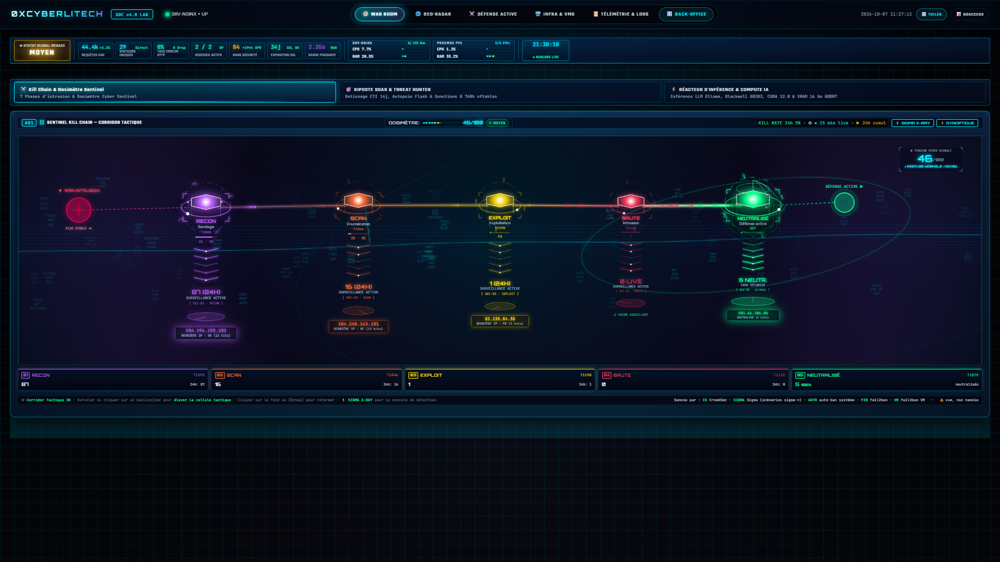
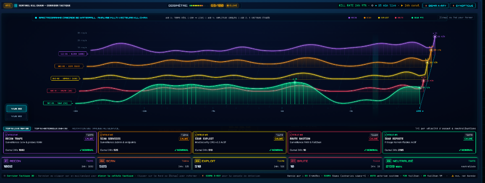
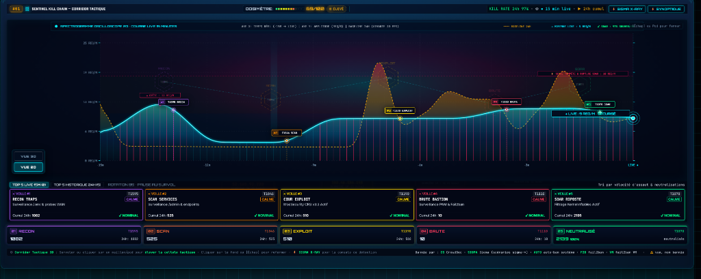
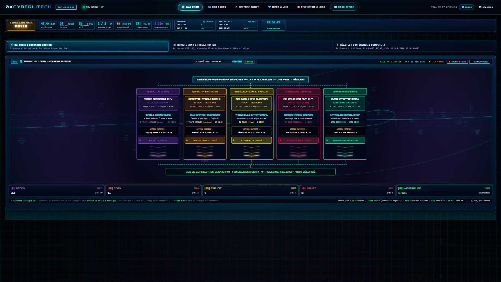
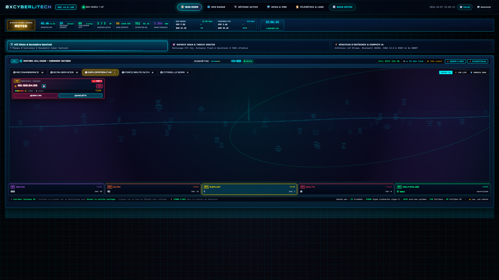
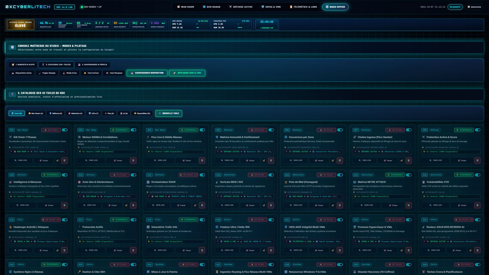
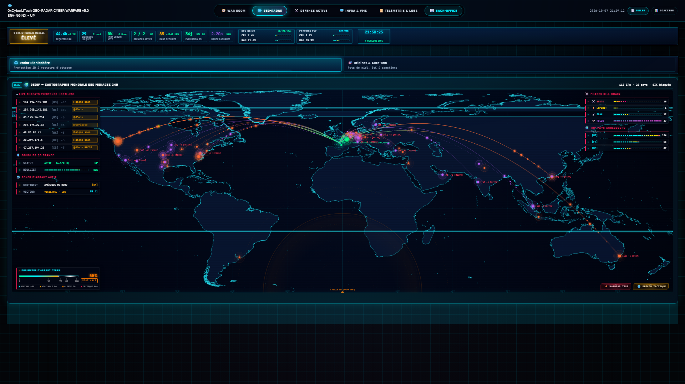
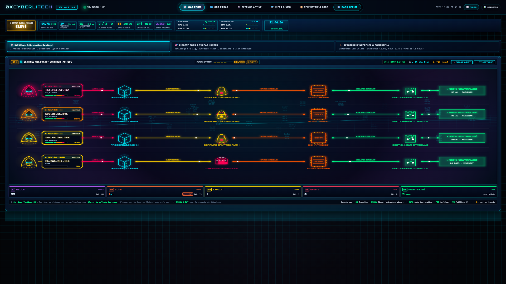
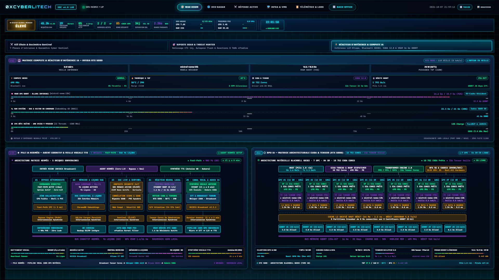

<div align="center">

  <br></br>

  <a href="https://github.com/0xCyberLiTech">
    
  </a>

  <br></br>

  <h2>SOC homelab · défense en profondeur · Kill Chain temps réel · IA intégrée</h2>

  <p align="center">
    <a href="https://0xcyberlitech.github.io/">
      
    </a>
    <a href="https://github.com/0xCyberLiTech">
      
    </a>
    <a href="https://github.com/0xCyberLiTech/SOC/releases/tag/v5.5.0">
      
    </a>
    <a href="https://github.com/0xCyberLiTech/SOC/blob/main/CHANGELOG.md">
      
    </a>
    <a href="https://github.com/0xCyberLiTech?tab=repositories">
      
    </a>
    <a href="https://github.com/0xCyberLiTech/SOC/graphs/contributors">
      
    </a>
  </p>

</div>

<div align="center">
  
</div>

<div align="center">
  <p>
    <strong>Cybersécurité défensive</strong>  &nbsp;•&nbsp; <strong>Homelab en production</strong>  &nbsp;•&nbsp; <strong>IA locale intégrée</strong> 
  </p>
</div>

> [!IMPORTANT]
> **Vitrine Technologique : Architecture & Démonstration d'Ingénierie**
> Ce dépôt présente le SOC homelab de Marc (0xCyberLiTech) et documente l'approche méthodologique, les règles de détection et les invariants architecturaux.
> 🔒 **Propriété Intellectuelle & Sécurité Opérationnelle** : Les scripts de déploiement et de restauration d'infrastructure, les règles complètes de production et les sources applicatives restent **strictement privés** au sein de l'Atelier souverain 0xCyberLiTech (sécurité de l'infrastructure, savoir-faire protégé).

---

<div align="center">

### ⚡ LE COCKPIT TACTIQUE EN PRODUCTION — EXTREME HUD v5.5

[](assets/soc-warroom-killchain.png)

*Poste de commandement War Room Extreme HUD v5.5 en production réelle 24h/24 : dosimètre Sentinel instantané, cinématique MITRE ATT&CK, télémétrie sub-200ms et zéro dépendance NPM.*

<p align="center">
  
  
  
  
  
</p>

</div>

---

## 🗺️ Sommaire Pédagogique

- 🎯 [1. Manifeste d'Ingénierie : L'Exigence Souveraine face aux Homelabs Ordinaires](#1--manifeste-dingénierie--lexigence-souveraine-face-aux-homelabs-ordinaires)
- 🔄 [2. Schéma Conceptuel Global : Dorsale de Collecte, Bus de Télémétrie & Cycle Nodal](#2--schéma-conceptuel-global--dorsale-de-collecte-bus-de-télémétrie--cycle-nodal)
- ⚔️ [3. Le Corridor Tactique Kill Chain & ses Sous-Interfaces Intégrées](#3-️-le-corridor-tactique-kill-chain--ses-sous-interfaces-intégrées)
- 🎛️ [4. Le Cockpit Extreme HUD & l'Ossature en Caissons Étanches](#4-️-le-cockpit-extreme-hud--lossature-en-caissons-étanches)
- 🧩 [5. Le Studio Back-Office, Catalogue de Tuiles & Grille Aimantée Modulaire](#5--le-studio-back-office-catalogue-de-tuiles--grille-aimantée-modulaire)
- 🌐 [6. Le Géo-Radar Vectoriel 2D & Traçage Balistique](#6--le-géo-radar-vectoriel-2d--traçage-balistique)
- ⚙️ [7. Le Synoptique Dynamique d'Attaque & Tableau de Bord du Moteur SIGMA](#7--le-synoptique-dynamique-dattaque--tableau-de-bord-du-moteur-sigma)
- 🤖 [8. Le Réacteur d'Inférence IA, Matrice Neurale & Voix Souveraine](#8--le-réacteur-dinférence-ia-matrice-neurale--voix-souveraine)
- 📐 [9. Dette Technique Zéro : La Règle d'Or du Plafond $\le 400$ Lignes](#9--dette-technique-zéro--la-règle-dor-du-plafond-le-400-lignes)
- 🧪 [10. L'Armure Qualité : 19 Gardiens Déterministes & Bancs Hostiles Niveau 4](#10--larmure-qualité--19-gardiens-déterministes--bancs-hostiles-niveau-4)
- 🖥️ [11. Topologie Synoptique du Homelab (Anonymisée)](#11--topologie-synoptique-du-homelab-anonymisée)
- 🔄 [12. Résilience & Disaster Recovery en 5 Minutes](#12--résilience--disaster-recovery-en-5-minutes)

---

## 1. 🎯 Manifeste d'Ingénierie : L'Exigence Souveraine face aux Homelabs Ordinaires

Dans la grande majorité des homelabs, les passionnés se contentent d'empiler des tableaux de bord préconfigurés (*Grafana*, *Homepage*, *Dashy*) ou de juxtaposer des conteneurs isolés qui s'effondrent à la première mise à jour. **Ce projet prend le contre-pied absolu de cette approche amateur.**

Bâti sous la gouvernance martiale de la **Doctrine Universelle de l'Atelier 0xCyberLiTech**, ce SOC homelab a été pensé, conçu et codé sur mesure avec les normes d'exigence des environnements critiques :

| Axe d'Évaluation | Homelab Traditionnel (99 %) | SOC Souverain 0xCyberLiTech (0,1 %) |
|:-----------------|:----------------------------|:-----------------------------------|
| **Environnement Réel** | Lab virtuel isolé en chambre étanche | **Production réelle exposée 24h/24** aux attaques réelles d'Internet |
| **Interface & Rendu** | Templates lourds, 10 onglets ouverts, latences | **Cockpit Extreme HUD v5.5 natif Vanilla JS/CSS** (< 200 ms) |
| **Dette Technique** | Fichiers monstres, scripts bricolés sans tests | **Dette Zéro scellée : 100 % des fichiers $\le 400$ lignes** (Règle 14.7) |
| **Garantie Qualité** | Vérifications manuelles épisodiques et trompeuses | **19 Gardiens CI/CD** + bancs E2E sous **Microsoft Edge réel** |
| **Fiabilité Télémétrique** | Approximations ou dérives des modèles LLM | **Déterminisme pur** : 0 hallucination sur les métriques et machines |
| **Alerte & Accessibilité** | Notifications mail passives ou interfaces muettes | **Passerelle vocale directe Windows MCI** (voix naturelle Antoine HD) |
| **Résilience Sinistre** | Sauvegardes manuelles non éprouvées | **Disaster Recovery automatisé** prêt à redéployer en 5 minutes |

---

## 2. 🔄 Schéma Conceptuel Global : Dorsale de Collecte, Bus de Télémétrie & Cycle Nodal

L'architecture du SOC repose sur une séparation stricte entre la collecte d'infrastructure, l'acheminement des métriques et la restitution opérateur :

```
                  [ CYBERESPACE : Scans, Bots, Exploits, Attaques C2 ]
                                            │
                                            ▼
┌─────────────────────────────────────────────────────────────────────────────────────────┐
│ 1. DORSALE DE COLLECTE (BACKBONE SOUVERAIN)                                             │
│ • Pare-feu Routeur Wi-Fi 7 (DPI)                • Filtrage UFW & blocage GeoIP MaxMind  │
│ • CrowdSec AppSec WAF (~180 règles vpatch CVE)  • Suricata IDS 7 (AF_PACKET kernel)     │
│ • Confinement d'accès AppArmor                  • Contrôle d'intégrité AIDE HIDS (4VMs) │
│ • Récepteur central rsyslog TCP/UDP 514         • Sondes thermiques & hardware Proxmox  │
└───────────────────────────────────────────┬─────────────────────────────────────────────┘
                                            │ Auscultation continue & flux EVE JSON
                                            ▼
┌─────────────────────────────────────────────────────────────────────────────────────────┐
│ 2. PIPELINE DE NORMALISATION & BUS D'ÉVÉNEMENTS                                         │
│ • Parsing haute performance multi-sources       • Enrichissement CTI & listes d'assaut  │
│ • Cycle Sigma : alert-only → dry-run → enforce  • Rail d'immunité RFC1918 (zéro fuite)  │
│ • Corrélation croisée XDR (WAF + IDS + HIDS)    • Calcul du ThreatScore (0 à 100)       │
└───────────────────────────────────────────┬─────────────────────────────────────────────┘
                                            │ Bus de Télémétrie structuré (< 200 ms)
                                            ▼
┌─────────────────────────────────────────────────────────────────────────────────────────┐
│ 3. BUS DE REDISTRIBUTION DU COCKPIT & RIPOSTE                                           │
│ • Distribution unifiée vers les 38 tuiles autonomes du Cockpit Extreme HUD              │
│ • Routage instantané vers la passerelle vocale native Windows MCI (Antoine HD)          │
│ • Déclenchement déterministe des ripostes kernel-space nftables (bannissements SOAR)    │
└─────────────────────────────────────────────────────────────────────────────────────────┘
```

### Le Principe de la Dorsale & du Bus de Redistribution :
* **La Dorsale d'Ingestion (Backbone) :** Les composants de production (VMs, hyperviseur, conteneurs, routeur frontal) ne sont jamais sollicités directement par l'interface. Une dorsale dédiée va moissonner en permanence les journaux, les sondes matérielles et les flux réseau, garantissant une charge d'auscultation ultra-légère et non intrusive sur la production.
* **Le Bus de Télémétrie & Corrélation :** Ce bus normalise les événements hétérogènes en un modèle de données unifié (`monitoring.json`). Il calcule en direct la corrélation temporelle des assauts, la classification MITRE ATT&CK et le score d'exposition global (*ThreatScore*).
* **Redistribution Découplée :** Le bus redistribue ce flux normalisé en temps réel vers le Cockpit Extreme HUD, le moteur vocal souverain Antoine HD et les modules de contre-mesure. Une panne éventuelle sur un capteur isolé ne perturbe jamais l'acheminement des métriques du reste du homelab.

---

## 3. ⚔️ Le Corridor Tactique Kill Chain & ses Sous-Interfaces Intégrées

Le sommet du Cockpit War Room est occupé par le **Corridor Tactique 3D (#01)**, modélisant en temps réel les phases d'assaut adverse et offrant un ensemble de sous-interfaces de pilotage directement embarquées :

* **1. Le Corridor Tactique 3D & Dosimètre Sentinel :**
  Visualisation en HTML5 Canvas des 7 phases de la Kill Chain (Reconnaissance, Scan, Exploitation, Intrusion Brute-force, Déplacement latéral, C2, Neutralisation). Chaque cellule d'attaque s'élève dynamiquement au survol avec affichage des compteurs cumulés 24h et des pods d'attaquants en direct.
* **2. Les Deux Modes Graphiques de Télémétrie Avancée (Waterfall 3D & Oscilloscope 2D) :**
  Accessible directement depuis la balise WAN ou via les sélecteurs HUD latéraux, la Kill Chain intègre un moteur d'auscultation spectrale dynamique :
  * **La Vue 3D Cascade (Spectrogramme Waterfall Isométrique) :** Modélisation tridimensionnelle multi-couches étagée sur les 5 vecteurs d'assaut majeurs, révélant la cinétique et la vélocité des assauts dans la profondeur spatiale :

[](assets/soc-killchain-telemetry-3d.png)

*Spectrogramme Cascade 3D Waterfall : projection volumétrique multi-vecteurs dans la profondeur spatiale, pins de télémesure pulsants et monitoring live 15 min / 24h.*

  * **La Vue 2D Linéaire (Oscilloscope Haute Précision) :** Signal temporel dynamique cadencé à 30 FPS, avec détection instantanée des lignes de crête, tags MITRE ATT&CK contextuels et seuils de rupture SOAR :

[](assets/soc-killchain-telemetry-2d.png)

*Oscilloscope 2D Linéaire : analyse oscillographique sub-seconde, comparaison continue avec la baseline 24h et marquage des tentatives d'exploitation.*

* **3. La Console Vectorielle SIGMA X-RAY (`⚡ SIGMA X-RAY`) :**
  Sous-interface interactive d'auscultation du moteur de règles. Elle affiche en direct les 5 caissons de filtrage (pièges secrets `.env`, scanning d'admin, RCE/Webshells CRS, bourrage SSH et riposte SOAR), le stade d'activation (`alert-only`, `dry-run`, `enforce`), les critères de détection déclenchés et les preuves forensiques associées :

[](assets/soc-killchain-sigma-xray.png)

*La Console SIGMA X-RAY embarquée dans la Kill Chain : auscultation des 5 caissons de détection, cartographie des pièges honeypots et bus de corrélation souverain.*

* **4. Le Synoptique Dynamique d'Attaque (`⚡ SYNOPTIQUE`) :**
  Sous-interface filaire (Wireframe) accessible en un clic, basculant la Kill Chain en cartographie causale directe : tracé balistique entre le cyberespace et les cibles, pods cyber détaillés (IPs, ASN, pays, sévérité), bus lumineux pulsants et mise en correspondance instantanée des techniques MITRE ATT&CK et contre-mesures D3FEND (détaillé au chapitre 7).
* **5. Le Deck Forensique & Élévation 3D (Drill-Down Nodal) :**
  Cliquer sur n'importe quel maillon ou pod de la Kill Chain élève la cellule tactique et déploie le deck d'investigation immédiat sans rechargement de page, révélant les requêtes brutes, le pays d'origine, le reverse DNS, les correspondances honeypots et les options de bannissement SOAR (1 an / permanent) :

[](assets/soc-killchain-3d-elevation.png)

*Élévation 3D de cellule & Deck d'investigation IP : drill-down immédiat au clic sur une menace active (Exploitation CVE, analyse ASN et bannissement direct nftables).*

---

## 4. 🎛️ Le Cockpit Extreme HUD & l'Ossature en Caissons Étanches

L'interface opérateur est conçue selon les principes d'ergonomie et de lisibilité d'un cockpit de défense (**Extreme HUD**) :

* **Organisation en 5 Espaces Opérationnels et 13 Sous-Onglets :**
  1. *Vue d'ensemble (War Room) :* Dosimètre cyber central, corridors de menaces et matrice de riposte.
  2. *Cyberdéfense :* Cascade active multi-couches, WAF CrowdSec, Suricata IDS, Fail2ban, Couverture par Zone et règles Sigma.
  3. *Cartographie :* Geo-Radar vectoriel 2D, globe balistique et analyse géographique des origines.
  4. *Infrastructure :* Hyperviseur Proxmox VE, intégrité AIDE HIDS (4 VMs), surveillance des crons et connectivité réseau.
  5. *Télémétrie XDR :* Logigramme nodal interactif, analyse forensique et historique 30 jours.
* **Le Concept Révolutionnaire des Caissons Étanches :**
  Chaque tuile est un sous-module JavaScript autonome et étanche. Elle ne dépend d'aucune tuile voisine et tire son état uniquement du flux du bus de télémétrie. Modifier ou enrichir une tuile se fait sans aucun risque de régression sur le reste du Cockpit.
* **Normalisation des Bargraphes LED :**
  Tous les affichages volumétriques et jauges respectent le conteneur étalon `.cyber-gauge-track` avec remplissage dynamique `.cyber-gauge-fill` (cyan, vert, ambre, violet, rouge), assurant une harmonie visuelle sans faille.

---

## 5. 🧩 Le Studio Back-Office, Catalogue de Tuiles & Grille Aimantée Modulaire

Pour offrir une gouvernance souveraine et un contrôle absolu sur l'affichage sans jamais altérer le code source en production, le SOC intègre un **Studio Back-Office complet** adossé à son catalogue unifié :

[](assets/soc-studio-catalogue-preview.png)

*Le Studio Back-Office souverain : matrice catalogue des 38 tuiles modulaires, sélection des 10 gabarits étalons, élasticité millimétrique des étagères et aperçu interactif Quick-Peek.*

### Les Capacités Maîtresses du Studio :
* **Catalogue Dynamique de 38 Tuiles Métier :** Inventaire unifié réparties sur 5 pôles fondamentaux (War Room, Cyberdéfense, Détection, Flux & Télémétrie, Infrastructure & Hôtes).
* **Gouvernance et Cycle de Vie des Tuiles :** L'opérateur peut activer une tuile, retirer une tuile d'un onglet actif pour la reverser dans la réserve du catalogue sans risque de régression sur le dashboard, en instancier de nouvelles ou en supprimer de manière sécurisée et étanche.
* **10 Gabarits Étalons (G-1 à G-10) :** Patrons de disposition géométriques permettant d'adapter instantanément l'agencement aux écrans tactiques 16:9, ultra-larges 21:9 ou moniteurs verticaux secondaires.
* **Élasticité Inviolable des Étagères :** L'opérateur pilote directement et en temps réel la hauteur des rangées (`row1`, `row2`) sans aucune valeur hardcodée dans le code.
* **Aperçu Temps Réel Quick-Peek :** Au survol ou par clic dans le catalogue, une modale de prévisualisation charge le composant réel en direct, permettant de tester son comportement interactif et ses jauges avant tout déploiement en production.

---

## 6. 🌐 Le Géo-Radar Vectoriel 2D & Traçage Balistique

Pour géolocaliser instantanément les origines d'attaque sans dépendre de services cartographiques externes lents ou indiscrets, le SOC embarque un **Geo-Radar 2D codé en HTML5 Canvas pur** :

[](assets/soc-geomap-radar.png)

*Le Geo-Radar 2D vectoriel : projection mondiale haute précision, centroïdes calibrés, arcs balistiques convergents et bascule temporelle 15 min / 24h.*

* **Projection Vectorielle Pure :** Élimine tout chargement de tuiles cartographiques externes. Les contours des continents et les centroïdes sont calculés au pixel près.
* **Arcs Balistiques Convergents :** Chaque tentative d'intrusion génère un arc balistique courbé reliant en temps réel le pays d'origine au homelab, pulsant d'une couleur proportionnelle à la sévérité de l'attaque.
* **Double Fenêtre Temporelle :** Analyse tactique sub-seconde sur les 15 dernières minutes ou consolidation stratégique sur 24 heures glissantes.

---

## 7. ⚙️ Le Synoptique Dynamique d'Attaque & Tableau de Bord du Moteur SIGMA

La détection d'intrusion ne repose pas sur de simples expressions régulières fragiles, mais sur un moteur **Detection-as-Code** appliquant les standards industriels **Sigma** et **MITRE ATT&CK**, directement matérialisé par le **Synoptique Dynamique d'Attaque** :

[](assets/soc-synoptique-attack-path.png)

*Le Synoptique Dynamique d'Attaque (Canvas & Causalité Wireframe) : tableau de bord temps réel de la résultante du moteur Sigma, pods cyber interactifs, bus lumineux et sanctions immédiates.*

### Le Synoptique : Résultante Visuelle du Moteur SIGMA :
* **Un Tableau de Bord Vivant & Réactif :** Loin d'une illustration statique, le Synoptique est l'émanation directe de l'état du moteur Sigma et des pièges honeypots. Il cartographie en direct la causalité entre le vecteur d'assaut hostile et l'infrastructure ciblée.
* **Lignes d'Attaque & Émoticônes Dynamiques :** Chaque ligne d'auscultation est dynamique. Selon la signature et le comportement de la menace (`RECON`, `SCAN`, `EXPLOIT`, `BRUTE`, `WEBSHELL`, `DNS_TUNNEL`, `DDOS`), les émoticônes, étiquettes, tags MITRE ATT&CK (T1595, T1046, T1190, T1110, T1505, T1071, T1499) et contre-mesures D3FEND s'adaptent instantanément à la charge utile détectée.
* **Pods Cyber & Traçage des Flux :** Chaque attaquant actif est représenté par un pod cyber affichant son adresse IP (anonymisée), son pays d'origine, son ASN, son score de sévérité et ses ports cibles. Des bus lumineux pulsants relient visuellement les flux adverses aux barrières de filtrage (WAF, IDS, kernel ban nftables).
* **Le Cycle de Vie Sigma Versionné :**
  1. **`alert-only` (Observation) :** La nouvelle règle analyse les flux réels sans bloquer, pour mesurer sa pertinence et éliminer les faux positifs.
  2. **`dry-run` (Simulation de ban) :** La sanction est simulée dans les journaux d'audit pour vérifier l'absence d'impact sur le trafic légitime.
  3. **`enforce` (Blocage actif sub-200ms) :** La règle est promue en production active ; toute correspondance déclenche un bannissement instantané en kernel-space via nftables et CrowdSec.

---

## 8. 🤖 Le Réacteur d'Inférence IA, Matrice Neurale & Voix Souveraine

Le SOC fusionne le renseignement cyber et l'intelligence artificielle locale (**JARVIS / Hermès**) déployée sur conteneur dédié avec accélération GPU matérielle :

<br/>

[](assets/soc-warroom-ia-matrix.png)

*Le Réacteur d'Inférence IA : monitoring panoramique GPU RTX 5080, matrice alvéolaire CUDA & Tensor, inférence LLM locale et bus vocal Antoine HD.*

### Les 3 Piliers de l'IA Souveraine :
* **Fast-Path Déterministe (< 200 ms) :**
  Tous les états factuels (santé des serveurs, adresses IP neutralisées, statut des sauvegardes) sont traités par du code machine direct. **Le modèle de langage n'intervient jamais sur les chiffres**, éliminant tout risque d'hallucination.
* **Passerelle Vocale Directe Windows MCI (Antoine HD) :**
  En cas d'incident critique, la voix naturelle d'Antoine HD annonce vocalement la nature de la menace et l'action de riposte directement sur les haut-parleurs de l'opérateur via le moteur natif MCI de Windows, sans dépendre du cloud.
* **Analyse Contextuelle Forensique LLM :**
  Un modèle local 12B accéléré sur GPU est mobilisé à la demande pour disséquer les requêtes web complexes, les injections obfusquées et les charges utiles malveillantes.

---

## 9. 📐 Dette Technique Zéro : La Règle d'Or du Plafond $\le 400$ Lignes

L'Atelier 0xCyberLiTech applique une règle d'or formelle : **l'interdiction des fichiers monstres et des monolithes inmaintenables** (Règle 14.7 de la Doctrine Universelle).

```
┌────────────────────────────────────────────────────────────────────────┐
│               LE PRINCIPE DE DÉCOUPAGE PRÉVENTIF (<= 400L)             │
├───────────────────────────────────┬────────────────────────────────────┤
│ • CONTRÔLEUR MAÎTRE (<= 250L)     │ • SOUS-MODULE DE RENDU (<= 350L)   │
│   Cycle de vie, polling & exports │   Génération HTML & templates DOM  │
├───────────────────────────────────┼────────────────────────────────────┤
│ • MOTEUR DE CALCUL (<= 300L)      │ • MODALES D'INSPECTION (<= 250L)   │
│   Normalisation & logique métier  │   Drill-down forensique au clic    │
└───────────────────────────────────┴────────────────────────────────────┘
```

* **100 % des Fichiers Conformes :** L'intégralité des modules JavaScript du dashboard et tous les scripts de maintenance (Bash et Python) respectent impérativement le plafond de **400 lignes maximum**.
* **Découpage Préventif Continu :** Dès qu'un composant approche des 350 lignes, il est immédiatement scindé en sous-modules étanches spécialisés (`*-components.js`, `*-engine.js`, `*-render.js`), interdisant tout entassement de code.
* **Le Verrou Mécanique Déterministe :** Le gardien logiciel [`soc_modules_ceiling_guard.py`](file:///D:/0xCyberLiTech/DEV/TOOLS/soc-modules-ceiling-guard/soc_modules_ceiling_guard.py) analyse l'intégralité du code source à chaque commit. Tout dépassement bloque automatiquement la validation.

---

## 10. 🧪 L'Armure Qualité : 19 Gardiens Déterministes & Bancs Hostiles Niveau 4

La fiabilité de la plateforme ne repose sur aucune promesse verbale, mais sur des **preuves mécaniques déterministes** exécutées en continu :

| Gardien / Banc d'Épreuve | Mission & Périmètre | Exigence Inviolable |
|:-------------------------|:--------------------|:-------------------:|
| **Suite Gardienne Maîtresse** | Batterie complète d'outils automatisés (syntaxe, linters ruff/eslint, intégrité, parité) | **19 / 19 GO (100% VERT)** |
| **Plafond Volumétrique** | Scan de chaque ligne de code (JS, Python, Shell) contre la Règle 14.7 | **0 fichier > 400 lignes** |
| **Bancs Hostiles Niveau 3** | Injection de fautes, stress canvas, valeurs nulles et payloads malformés | **100 % de succès sans exception** |
| **Bancs E2E Niveau 4 (Edge)** | Robotisation automatisée sous Microsoft Edge Headless réel (clics, modales, DOM) | **0 erreur JS en console** |
| **Parité Tripartite** | Contrôle cryptographique au bit près (Atelier D: ➔ Sandbox Staging ➔ Production Nginx) | **100 % aligné (0 dérive)** |
| **Gardiens Anti-Fuite** | Détection automatique des identifiants et des adresses IP internes privées | **0 fuite dans les dépôts publics** |

---

## 11. 🖥️ Topologie Synoptique du Homelab (Anonymisée)

```
                       [ ACCÈS INTERNET FIBRE ]
                                  │
                                  ▼
               ┌─────────────────────────────────────┐
               │     Routeur Dédié Wi-Fi 7 ROG       │
               │   Pare-feu SPI · AiProtection DPI   │
               └──────────────────┬──────────────────┘
                                  │
          ┌───────────────────────┴───────────────────────┐
          │                                               │
          ▼                                               ▼
┌───────────────────────────────────┐   ┌───────────────────────────────────┐
│     SERVEUR NAS MINISFORUM        │   │    HYPERVISEUR PROXMOX VE         │
│  OMV8 · Pools ZFS Miroirs Raid    │   │  Virtualisation Bare-Metal KVM    │
│  Snapshots Chiffrés · Coffres DR  │   │  Nœud Haute Disponibilité         │
└───────────────────────────────────┘   └─────────────────┬─────────────────┘
                                                          │
                    ┌─────────────────────────────────────┼─────────────────────────────────────┐
                    ▼                                     ▼                                     ▼
        ┌───────────────────────┐             ┌───────────────────────┐             ┌───────────────────────┐
        │  VM REVERSE PROXY WAF │             │  VM SANDBOX DE QUALIF │             │  CONTENEUR IA JARVIS  │
        │  Debian 13 · Nginx    │             │  Debian 13 · Staging  │             │  Debian 13 · Core     │
        │  CrowdSec · Suricata  │             │  Bancs Hostiles E2E   │             │  Fast-Path · TTS MCI  │
        │  Fail2ban · AIDE HIDS │             │  Qualification Dev    │             │  Ollama Mistral-Nemo  │
        └───────────────────────┘             └───────────────────────┘             └───────────────────────┘
```

| Nœud Réseau | Type d'Hôte | Système | Fonctions Principales |
|:------------|:-----------:|:-------:|:----------------------|
| **Hyperviseur Nodal** | Bare-metal | Proxmox VE | Virtualisation KVM, gestion des ponts réseau virtuels, monitoring ZFS |
| **Reverse Proxy WAF** | Machine Virtuelle | Debian 13 | Nginx frontal, CrowdSec WAF, Suricata IDS, Fail2ban, AIDE HIDS |
| **Plateforme Dev Sandbox** | Machine Virtuelle | Debian 13 | Environnement de qualification miroir, exécution des bancs d'essais hostiles |
| **Serveurs d'Applications** | Machines Virtuelles | Debian 13 | Services applicatifs durcis, profils AppArmor, forwarders rsyslog |
| **Cerveau IA JARVIS** | Conteneur Dédié | Debian 13 | Moteurs d'arbitrage déterministe, API TTS, exécution des modèles locaux |
| **Stockage & Coffres DR** | NAS Physique | OMV8 / ZFS | Stockage centralisé, réplication des pools ZFS, archives chiffrées |
| **Passerelle Réseau** | Routeur Dédié | Wi-Fi 7 / Merlin | Pare-feu frontal SPI, isolation VLANs, filtrage matériel DPI |

---

## 12. 🔄 Résilience & Disaster Recovery en 5 Minutes

Le SOC intègre une doctrine de résilience absolue validée par des exercices réguliers de sinistre :

* **Capacité RPO/RTO en 5 Minutes :** Processus de reconstruction complète et restauration à chaud de l'infrastructure validé lors d'exercices réels sous chronomètre.
* **Intégrité Cryptographique & Isolement :** Coffres de sauvegarde chiffrés et étanches, réplication hors-ligne et vérification d'intégrité avant redémarrage.
* **Sanctuarisation Stricte de l'Infrastructure :** Les automatisations de déploiement, de sauvegarde et de reprise d'activité (PRA) sont maintenues exclusivement dans l'Atelier privé. Seules les checklists d'audit et guides d'ingénierie sont partagés à titre méthodologique, garantissant l'inviolabilité absolue des systèmes de production.

---

<div align="center">

<table>
<tr>
<td align="center"><b>🖥️ Infrastructure & Sécurité</b></td>
<td align="center"><b>💻 Développement & Web</b></td>
<td align="center"><b>🤖 Intelligence Artificielle</b></td>
</tr>
<tr>
<td align="center">
  <a href="https://www.kernel.org/"></a>
  <a href="https://www.debian.org"></a>
  <a href="https://www.gnu.org/software/bash/"></a>
  <br/>
  <a href="https://nginx.org"></a>
  <a href="https://git-scm.com"></a>
</td>
<td align="center">
  <a href="https://www.python.org"></a>
  <a href="https://flask.palletsprojects.com"></a>
  <a href="https://developer.mozilla.org/docs/Web/HTML"></a>
  <br/>
  <a href="https://developer.mozilla.org/docs/Web/CSS"></a>
  <a href="https://developer.mozilla.org/docs/Web/JavaScript"></a>
  <a href="https://code.visualstudio.com"></a>
</td>
<td align="center">
  <a href="https://ollama.com"></a>
  <br/><br/>
  <a href="https://anthropic.com"></a>
</td>
</tr>
</table>

<br/>

<sub>🔒 Projets proposés par <a href="https://github.com/0xCyberLiTech">0xCyberLiTech</a> · Développés en collaboration avec <a href="https://claude.ai">Claude AI</a> (Anthropic) 🔒</sub>

</div>
